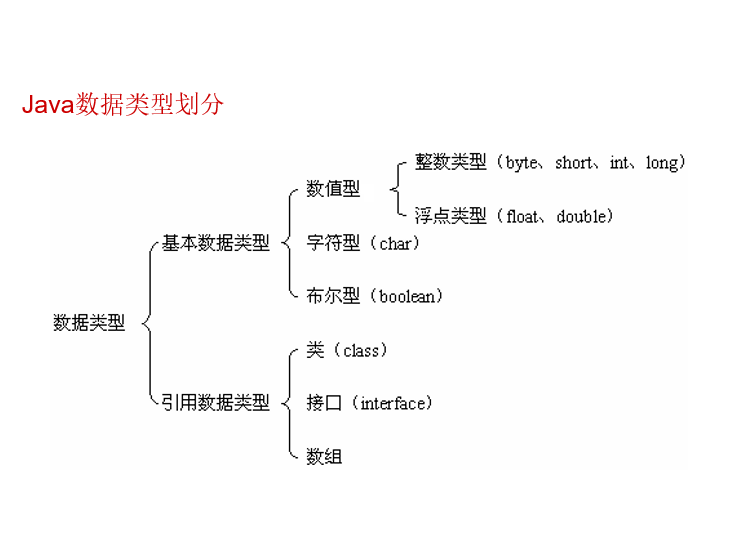
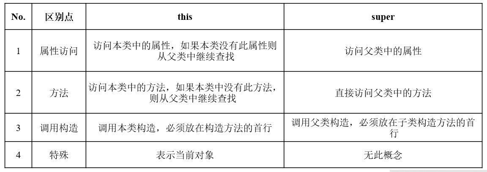
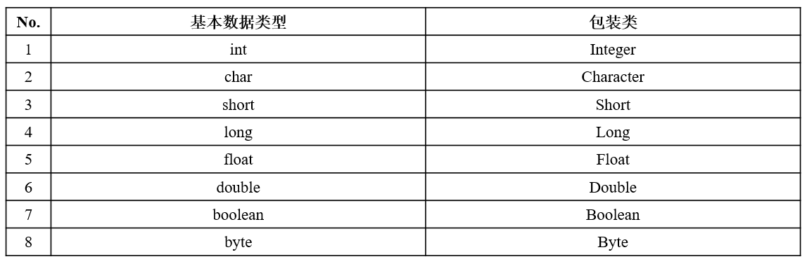
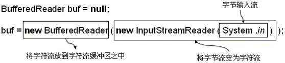

# Java Notes

## Java 概述 

### Java 语言特性

* 简单性
* 面向对象
* 分布式
* 鲁棒性 
* 安全性
* 体系结构中立（平台无关性） 
* 可移植性
* 解释执行 
* 高性能 
* 多线程
* 动态性

### Java 与 C/C++ 的比较  

* Java 中不允许在类之外定义全局变量，而只能通过在类中定义静态变量来实现；
* Java 中没有 goto 语句；
* Java 中没有指针型变量；
* 内存管理实现了自动化；
* Java 对于不同的数据类型定义统一的规格，保证了平台无关性；
* Java 语言中不允许像 C 和 C++ 中那样任意进行类型转换；
* Java 语言中无头文件；
* Java 语言中无结构体和联合；
* Java 语言中无预处理和宏定义。

## 注释

### Java 文档注释

* ```
  文档注释以 "/**" 开始，以 "*/" 标志结束
  ```

* 批注参数

  ```
  批注参数来标记一些特殊的属性及其相应的说明：
  @author<作者>
  @version<版本>
  @param<参数名><参数说明>
  @return<返回值说明>
  ```

### Java 程序的注释

java注释根据功能不同分为三种：

* 单行注释
* 多行注释
* 文档注释

## Java 命名规范

* 类：

  > 所有单词的首字母大写，如：TestJava

* 方法：

  >  第一个单词的首字母小写，之后每个单词的首字母大写，如：getInfo()

* 属性：

  > 第一个单词的首字母小写，之后每个单词的首字母大写，如：studentName

* 包：

  > 所有单词的字母小写，如：：org.lxh.demo

* 常量：

  > 所有单词的字母大写，如：FLAG

## 语法

### 使用 public class 和 class 声明的区别

* 如果一个类声明为public class则文件名称必须与类名称一致，而且在一个类中只能有一个public class，而如果使用class声明一个类，则文件名称可以与类名称不一致，但是执行的时候必须执行生成的class文件名称。
* 除了这些之外，public class和class还在包的访问上有所限制，如果一个类只在本包中访问，不需要被外包访问，则直接声明成class即可，而如果一个类需要被外包访问，则必须声明为public class。

### Java 数据类型划分



#### 引用数据类型

> 引用类型的变量是所引用的对象的内存地址。

#### 数据类型的转换

##### 自动类型转换

* 在程序中已经定义好了数据类型的变量，若是想用另一种数据类型表示时，Java 会在下列的条件皆成立时，自动做数据类型的转换：
  * 转换前的数据类型与转换后的类型兼容。
  * 转换后的数据类型的表示范围比转换前的类型大。 

* 任何类型的数据都向 String 转型

##### 强制类型转换

转换语法如下：

> （欲转换的数据类型）变量名称

### 关于 "&&" 与 "&"、"||" 与 "|" 的说明

#### "&&" 与 "&"

```
&&表示短路与；
对于“与”来说，要求所有的条件都判断，而如果使用“短路与”如果第一个条件为false，则后面的条件将不再判断。
```

#### "||" 与 "|"

```
||表示短路或；
对于“或”来说，要求所有的条件都判断，而如果使用“短路或”如果第一个条件为true，则后面的条件将不再判断。
```

### 内存

#### 栈内存和堆内存

> 程序中定义的基本类型的变量和引用类型变量在栈内存中分配；
> 堆内存用来存放由 new 创建的对象和数组。

#### 堆栈内存的解释

> 数组操作中，在栈内存中保存的永远是数组的名称，只开辟了栈内存空间数组是永远无法使用的，必须有指向的堆内存才可以使用，要想开辟新的堆内存则必须使用new关键字，之后只是将此堆内存的使用权交给了对应的栈内存空间，而且一个堆内存空间可以同时被多个栈内存空间指向，即：一个人可以有多个名字，人就相当于堆内存，名字就相当于栈内存。

### 数组

#### 一维数组 

* 声明形式一：

  > 声明一维数组：数据类型 数组名[] = null ;
  >
  > 分配内存给数组：数组名 =  new 数据类型[长度] ; 

* 声明形式二：

  > 声明一维数组：数据类型[] 数组名= null ; 

#### 取得数组长度

```
数组名称.length：返回一个int型数据。
```

#### 数组的引用传递

##### 传递及返回数组

> 如果要向方法中传递一个数组，则方法的接收参数处必须是符合其类型的数组。而且数组属于引用数据类型，所以在把数组传递进方法之后，如果方法对数组本身做了任何修改，修改结果都是会保存下来的；

> 既然方法可以接收一个数组，那么方法也就可以返回一个数组，则此时，只需要在返回值类型声明处明确的写出返回的数组类型即可。

#### 数组拷贝

```java
//使用Java类库中的方法完成数组拷贝操作 
System.arraycopy()
```

### 方法

#### 方法的重载

> 方法的重载就是方法名称相同，但参数的类型和参数的个数不同，通过传递参数的个数及类型不同以完成不同功能的方法调用；
> 方法的重载一定只是在参数上的类型或个数不同。

- 提示：System.out.println()方法也属于重载方法
- 对于屏幕打印语句：System.out.print()方法来说可以打印任何的数据
- print() 和 println() 的区别在于是否自动换行

## 面向对象（OO）

### 面向对象的三大特征

* 封装（Encapsulation）

  >  对外部不可见

* 继承（Inheritance）

  > 扩展类的功能

* 多态（Polymorphism）

  > 方法的重载
  >
  > 对象的多态性

### 访问类中的属性和方法

```
访问属性：对象名称.属性名；
访问方法：对象名称.方法名()。
```

### 封装的实现

```
为属性封装：private 属性类型 属性名称；
为方法封装：private 方法返回值 方法名称(参数列表){}。
```

#### setter 及 getter

### 构造方法与匿名对象

#### 构造方法

```
在构造方法的声明中读者一定要牢记以下几点：
		· 构造方法的名称必须与类名称一致
		· 构造方法的声明处不能有任何返回值类型的声明
		· 不能在构造方法中使用return返回一个值
```

##### 默认的构造方法

> 每个类中肯定都会有一个构造方法；
> 如果一个类中没有声明一个明确的构造方法则会自动生成一个无参的什么都不做的构造方法；
> 一旦编程者为该类定义了构造方法，系统就不再提供默认的构造方法了。 

##### 构造方法重载

> 构造方法的重载过程与普通方法一样：
> 参数的类型或个数不同；

##### 构造方法私有化

> 类的封装性不光体现在对属性的封装上，实际上方法也是可以被封装的，当然，在方法封装中也包含了对构造方法的封装。

#### 匿名对象

```
只使用一次的对象，称为匿名对象；
匿名对象只在堆内存中开辟空间，而不存在栈内存的引用。
```

### String 类

#### String 的初始化

* 直接赋值：

  ```java
  String name = "LiXingHua";
  ```

- 通过关键字new

  ```java
  String name = new String("LiXingHua");
  ```

#### String 的比较方式

> ==：地址值比较；
> equals()方法：内容比较；

```
静态域：存放在类中用static定义的静态成员；
常量池：常量值通常直接存放在代码内部。
```

#### String 类的常用方法

```java
//构造函数，直接将一个字符数组变为一个字符串
public String(char[] value)
    
//构造函数，将一个指定范围的字符数组变为字符串
public String(char[] value,int offset,int count)
    
//构造函数，将一个byte数组全部变为字符串
public String(byte[] bytes)
    
//构造函数，将指定范围的byte数组变为字符串
public String(byte[] bytes,int offset,int length)
    
//将一个字符串变为字符数组
public char[] toCharArray()
    
//从一个字符串中取出指定位置的字符
public char charAt(int index)
    
//将一个字符串变为byte数组
public byte[] getBytes()
    
//取得字符串长度
public int length()
    
//从头开始查找指定的字符串位置
public int indexOf(String str)
    
//从指定位置开始查找指定的字符串位置
public int indexOf(String str,int fromIndex)
    
//清除左右两端的空格
public String trim()
    
//从指定位置开始，一直取到尾进行字符串的截取
public String substring(int beginIndex)
    
//指定截取字符串的开始点和结束点
public String substring(int begin,int end)
    
//按照指定的字符串对字符串进行拆分（*）
public String[] split(String regex)
    
//将一个字符串全部变为大写字母
public String toUpperCase()
    
//将一个字符串全部变为小写字母
public String toLowerCase()
    
//判断是否以指定的字符串开头
public boolean startsWith(String prefix)
    
//判断是否以指定的字符串结尾
public boolean endsWith(String suffix)
    
//判断两个字符串内容是否相等
public boolean equals (String str)
    
//不区分大小写比较两个字符串是否相等
public boolean equalsIgnoreCase(String str)
    
//字符串替换（*）
public String replaceAll(String regex,String replacement)
```

### this 关键字

```
this 的作用：
	可以使用 this 调用本类中的方法；
	调用类中的属性；
	可以使用 this 调用本类的构造方法；
	this 在方法内部就是这个方法所属的对象的引用变量。
```

#### this 引用句柄的存放位置

```
每个成员方法内部，都有一个this引用变量，指向调用这个方法的对象。
```

##### this 引用句柄的应用

使用 this 调用构造方法：
>构造方法是在产生对象时被java系统自动调用的，我们不能在程序中象调用其他方法一样去调用构造方法；但我们可以在一个构造方法里调用其他重载的构造方法，不是用构造方法名，而是用this(参数列表)的形式，根据其中的参数列表，选择相应的构造方法；使用this调用构造方法必须也只能放在构造方法的第一行。

### static 关键字和 main 方法

#### static 静态变量

##### 如何访问 static 静态变量

类中：
>类中的成员方法可以直接访问静态成员变量

类外：
>1.使用：类名.成员
>
>2.使用：对象名.成员

#### static 静态方法

静态成员方法：类中定义的方法前加上 static 关键字。

##### 如何访问 static 静态方法

类中：
>类中的成员方法可以直接访问静态成员方法

类外：
>1.使用：类名.成员
>
>2.使用：对象名.成员

##### static 静态方法说明

>在一个类中，静态方法里只能直接调用其它的静态成员（包括变量和方法），而不能直接访问同类中的非静态成员。（这是因为，对于非静态的方法和变量，需要先创建类的实例对象后才可使用，而静态方法在使用前不用创建任何对象。）

##### main 静态方法

 >main() 方法是静态的，在main()方法中，我们不能直接访问该类中的非静态成员，必须创建该类的一个实例对象后，才能通过这个对象去访问类中的非静态成员。

#### main 方法

```java
public static void main(String args[])
```
### 对象数组

#### 对象数组的声明

```java
类 对象数组名称[] = new 类[数组长度]；
```

### 类的关系及复用

#### 类的关系

* 依赖关系

  > 假设A类的变化引起了B类的变化，则B类依赖于A类；
  >
  > 依赖关系体现在某个类的方法使用另一个类的对象作为参数。

* 关联关系

  > 是类与类之间最常用的一种关系，它是一种结构化关系，用于表示一类对象与另一类对象之间有联系。 
  >
  > 在UML类图中，用实线连接有关联的对象所对应的类，在使用Java、C#和C++等编程语言实现关联关系时，通常将一个类的对象作为另一个类的属性。

* 聚合关系

  > 表示的是整体和部分的关系，整体与部分可以分开。

* 组合关系

  > 也是整体与部分的关系，但是整体与部分不可以分开。（也叫合成关系）

* 泛化关系

  > 泛化关系(Generalization)也就是继承关系，也称为“is-a-kind-of”关系或者“is a”关系，泛化关系用于描述父类与子类之间的关系，父类又称作基类或超类，子类又称作派生类。

* 实现关系

  > 接口和类之间还存在一种实现关系(Realization)，在这种关系中，类实现了接口，类中的操作实现了接口中所声明的操作。

#### 类的复用

合成/聚合复用原则 （设计原则之一）：

> 尽量使用合成/聚合，尽量不要使用类继承。

### 继承

#### 类的继承格式

* 在 Java 中使用 extends 关键字完成类的继承关系，操作格式：

  ```java
  class 父类{}			// 定义父类
  class 子类 extends 父类{}	// 使用extends关键字实现继承 
  ```

* 在 Java 中只允许单继承，不能使用多重继承，但允许进行多层继承。

#### 方法的覆写

> 所谓的方法覆写就是指子类定义了与父类中同名的方法；
>
> 被子类覆写的方法不能拥有比父类方法更加严格的访问权限。 

##### 调用父类中被子类覆写过的方法

>在子类中可以使用“super.方法()”的形式，从子类访问父类中的方法。

##### super 关键字的作用

> 使用super可以从子类中调用父类中的构造方法、普通方法、属性。

##### this 与 super 的区别



#### 属性的覆盖

> 所谓的属性覆盖就是指子类声明了与父类同名的属性。

### final 关键字

final 在 java 中表示的意思是最终的意思。也可以称为完结器。可以使用 final 关键字声明类、属性、方法： 

* 使用 final 声明的类不能有子类；
* 使用 final 声明的方法不能被子类所覆写；
* 使用 final 声明的变量即成为常量，常量不可以修改。	

#### 全局常量

> 使用 static final 关键字联合声明的变量称为全局常量。

### 抽象类

#### 抽象类的定义及使用规则

* 包含一个抽象方法的类必须是抽象类；
* 抽象类和抽象方法都要使用 **abstract** 关键字声明；
* 抽象方法只需声明而不需要实现；
* 抽象类不能被直接实例化。抽象类必须被子类继承，子类（如果不是抽象类）必须覆写抽象类中的全部抽象方法。 

#### 抽象类的定义格式 

```java
abstract class 抽象类名称{
	属性 ;
	访问权限 返回值类型 方法名称(参数){			// 普通方法
		[return 返回值] ;
	}
	访问权限 abstract 返回值类型 方法名称(参数) ; 		// 抽象方法
	// 在抽象方法中是没有方法体的
}
```

#### 抽象类的思考

* 一个抽象类可以使用 final 关键字声明吗？

  > 一个类如果使用了 final 关键字声明，则此类不能被子类继承，而抽象类又必须被子类覆写，所以很明显，问题的答案是：“一个抽象类不能使用 final 关键字声明”。

* 一个抽象类中可以定义构造方法吗？

  > 实际上在一个抽象类中是允许存在构造方法的，因为抽象类依然使用的是类的继承关系，而且抽象类中也存在各个属性，所以子类在实例化之前肯定是先要对父类进行实例化的。

### 接口

接口是 java 中最重要的概念，接口可以理解为一种特殊的类，里面全部是由全局常量和公共的抽象方法所组成。

#### 接口的定义格式

```java
interface 接口名称{
	全局常量 ;
	抽象方法 ;
}
//注： 接口中没有构造方法,不能被直接实例化
```

#### 接口的定义

* 完整格式：

  ```java
  interface A{
  	public static final String AUTHOR = "李兴华" ;		// 定义全局常量
  	public abstract void print() ;				// 定义抽象方法
  	public abstract String getInfo() ;			// 定义抽象方法
  }
  ```

- 简化格式：

  ```java
  interface A{
  	String AUTHOR = "李兴华" ;	// 等价于：public static final String AUTHOR = "李兴华" ;
  	void print() ;		// 等价于：public abstract void print() ;
  	String getInfo() ;		// 等价于：public abstract String getInfo() ;
  }
  ```

#### 实现接口

* 与抽象类一样，接口要使用也必须通过子类，子类通过 implements 关键字实现接口。 
  实现格式：

  ```java
  class 子类 implements 接口A,接口B,...{
  	} 
  ```

* 当类实现了某个 Java 接口时,它必须实现接口中的所有抽象方法,否则这个类必须声明为抽象的；

- 不允许创建接口的实例(实例化),但允许定义接口类型的引用变量,该引用变量引用实现了这个接口的类的实例，如：

  ```java
  public class B implements A{}  
        A a = new B(); //引用变量a被定义为A接口类型,引用了B实例  
        A a = new A(); //错误,接口不允许实例化     
  ```

#### 继承抽象类实现接口 

一个子类可以同时继承抽象类和实现接口。

格式如下：

```java
class 子类 extends 抽象类 implements 接口A,接口B,...{}
```

#### 接口和抽象类的使用限制

* 在 java 中允许一个抽象类实现多个接口；

#### 接口的继承

一个接口不能继承一个抽象类，但是却可以通过extends关键字同时继承多个接口，实现接口的多继承。格式：

```java
interface 子接口 extends 父接口A,父接口B,...{}
```

#### Java8 对接口的改变

* 增加了静态方法；

  ```java
  public interface Calculator {
  
  //设计模式中的工厂方法，增加的静态方法
   static Calculator getInstance() {
         return new BasicCalculator();
    }
    int add(int first, int second);
  
    int subtract(int first, int second);
  
    int divide(int number, int divisor);
  
    int multiply(int first, int second);
  }
  
  class BasicCalculator implements Calculator {
  
    public int add(int first, int second) {
      return first + second;
    }
    public int subtract(int first, int second) {
      return first - second;
    }
    public int divide(int number, int divisor) {
      if (divisor == 0) {
        throw new IllegalArgumentException("divisor can't be zero.");
      }
      return number / divisor;
    }
    public int multiply(int first, int second) {
      return first * second;
    }
  }
  
  public class TestStatic {
  public static void main(String[] args) {
  
       Calculator  t=Calculator.getInstance();
       int i=t.add(1, 2);
      System.out.print(i);
  }
  }
  ```

- 增加默认方法；

  * 接口的实现类不需要再提供接口的实现方法。如果接口的实现类提供了方法，那么实现类的方法会被调用，否则接口中的方法会被调用。

  * 注意：接口的默认方法不能通过接口名直接调用，例如：

    > Calculator.remainder(1,2);

    ```java
    public interface Calculator {
      int add(int first, int second);
      int subtract(int first, int second);
      int divide(int number, int divisor);
      int multiply(int first, int second);
      //增加的默认方法
      default int remainder(int number, int divisor) {
          return subtract(number, multiply(divisor, divide(number, divisor)));
     }
    }
    ```

  * 接口默认方法使用的几种情况：

    * 规则一：定义在类中的方法优先于定义在接口的方法；

      ```java
      interface A {
        default void doSth(){
        System.out.println("inside A");
        }
      }
      class App implements A{
        public void doSth() {
          System.out.println("inside App");
        }
      
        public static void main(String[] args) {
          new App().doSth();
        }
      }
      //运行结果：inside App。调用的是在类中定义的方法。
      ```

    * 规则二：否则，调用定制最深的接口中的方法；

      ```java
      interface A {
        default void doSth() {
          System.out.println("inside A");
        }
      }
      interface B {}
      interface C extends A {
        default void doSth() {
          System.out.println("inside C");
        } 
      }
      class App implements C, B, A {
      
        public static void main(String[] args) {
          new App().doSth();
        }
      }
      //运行结果：inside C
      ```

    * 规则三：否则，直接调用指定接口的实现方法。

      ```java
      interface A {
        default void doSth() {
          System.out.println("inside A");
        }
      }
      interface B {
        default void doSth() {
          System.out.println("inside B");
        }
      }
      class App implements B, A {
      
        public void doSth() {
           B.super.doSth();
        }
      
        public static void main(String[] args) {
            new App().doSth();
        }
      }
      //运行结果： inside B
      ```

### 多态性

#### 对象的多态性

##### 向上转型与向下转型

* 向上转型：子类对象 -> 父类对象

  > 对于向上转型，程序会自动完成，格式：
  >
  > 对象向上转型：父类 父类对象 = 子类实例 ;

	```java
	//对象的向上转型 
	class A{						// 定义类A
		public void fun1(){				// 定义fun1()方法
			System.out.println("A --> public void fun1(){}") ;
		}
		public void fun2(){				// 定义fun2()方法
			this.fun1() ;
		}
	};
	class B extends A{					// 子类通过extends继承父类
		public void fun1(){				// 覆写父类中的fun1()方法
			System.out.println("B --> public void fun1(){}") ;
		}
		public void fun3(){				// 子类自己定义的方法
			System.out.println("B --> public void fun3(){}") ;
		}
	};
	public class PolDemo01 {
		public static void main(String[] args) {
			B b = new B() ;				// 定义子类实例化对象
			A a = b ;				// 发生了向上转型的关系，子类 --> 父类
			a.fun1();				// 此方法被子类覆写过
		}
	}
	//输出结果：B --> public void fun3(){}
	```

- 向下转型：父类对象 -> 子类对象

  > 对于向下转型时，必须明确的指明要转型的子类类型，格式：
  >
  > 对象向下转型：子类 子类对象 = (子类)父类实例 ;
  >
  > 在进行对象的向下转型之前，必须首先发生对象向上转型才可以，否则将出现对象转换异常。
	```java
	//对象的向下转型
	class A{						// 定义类A
		public void fun1(){				// 定义fun1()方法
			System.out.println("A --> public void fun1(){}") ;
		}
		public void fun2(){				// 定义fun2()方法
			this.fun1() ;
		}
	};
	class B extends A{				// 子类通过extends继承父类
		public void fun1(){				// 覆写父类中的fun1()方法
			System.out.println("B --> public void fun1(){}") ;
		}
		public void fun3(){				// 子类自己定义的方法
			System.out.println("B --> public void fun3(){}") ;
		}
	};
	public class PolDemo02 {
		public static void main(String[] args) {
			A a = new B() ;			// 发生了向上转型的关系，子类 --> 父类
			B b = (B)a ;			// 此时发生了向下转型关系
			b.fun1() ;				// 调用方法被覆写的方法 
			b.fun2() ;				// 调用父类的方法
			b.fun3() ;				// 调用子类自己定义的方法
		}
	}
	//输出结果：
	```

##### 多态的机制应用范围

* 多态的机制只用在方法上，对属性不适用；
* 多态的机制只用在非静态方法上，对静态方法不适用；

### instanceof 关键字

#### instanceof 操作符

* 可以用 instanceof 判断一个对象是否实现了某个接口；
* 也可以用它来判断一个实例对象是否属于某一个类。
* 语法格式：
  >对象  instanceof 类(或接口)
* 返回值：
  >true   false

### Object 类

Object 类是 Java 中所有类的基类，位于 java.lang 包中。一个类只要没有明显的继承一个类，则肯定是 Object 类的子类。Object 如下两种代码表示的含义都是一样的：

```java
class Person extends Object{}
class Person{}
```

* Object类中的主要方法：

  ```java
  //构造方法
  public Object()
  
  //对象比较
  public boolean equals(Object obj)
  
  //对象打印时调用
  public String toString()
  ```

### 包装类

#### 包装类



#### 包装类中的继承关系

* Integer、Byte、Float、Double、Short 、Long 都属于 Number 类的子类，Number 类本身提供了一系列的返回以上六种基本数据类型的操作。
* Character 属于 Object 的直接子类。
* Boolean 属于 Object 的直接子类。

#### Number 类的定义

Number 类是一个抽象类，主要是将数字包装类中内容变为基本数据类型，主要操作方法如下：

| No.  | 方法                                 | 类型 | 描述                       |
| ---- | ------------------------------------ | ---- | -------------------------- |
| 1    | public byte byteValue()              | 普通 | 以byte形式返回指定的数值   |
| 2    | public abstract double doubleValue() | 普通 | 以double形式返回指定的数值 |
| 3    | public abstract float floatValue()   | 普通 | 以float形式返回指定的数值  |
| 4    | public abstract int intValue()       | 普通 | 以int形式返回指定的数值    |
| 5    | public abstract long longValue()     | 普通 | 以long形式返回指定的数值   |
| 6    | public short shortValue()            | 普通 | 以short形式返回指定的数值  |

#### 装箱与拆箱

* 装箱：

  > 将一个基本数据类型变为包装类，这样的过程称为装箱操作；

* 拆箱：

  > 将一个包装类变为基本数据类型这样的过程称为拆箱操作；

- 装箱及拆箱操作：

  ```java
  //示例1
  public class WrapperDemo01 {
  	public static void main(String[] args) {
  		int x = 30 ;					// 声明一个基本数据类型
  		Integer i = new Integer(x) ;	// 装箱：将基本数据类型变为包装类
  		int temp = i.intValue() ;		// 拆箱：将一个包装类变为基本数据类型
  	}
  }
  
  //示例2
  public class WrapperDemo02 {
  	public static void main(String[] args) {
  		float f = 30.3f ;			// 声明一个基本数据类型
  		Float x = new Float(f) ;	// 装箱：将基本数据类型变为包装类
  		float y = x.floatValue() ;	// 拆箱：将一个包装类变为基本数据类型
  	}
  }
  ```

#### 自动装箱及拆箱操作 

在 JDK 1.5 之后提供了自动的装箱及拆箱操作：

```java
public class WrapperDemo03 {
	public static void main(String[] args) {
		Integer i = 30 ;			// 自动装箱成Integer
		Float f = 30.3f ;			// 自动装箱成Float
		int x = i ;				// 自动拆箱为int
		float y = f ;				// 自动拆箱为float
	}
}
```

#### 包装类应用（Integer、Float为例）

包装类在实际中用得最多的还在于字符串变为基本数据类型的操作上，例如：将一个全由数字组成的字符串变为一个int或float类型的数据。在Integer和Float类中分别提供了以下的两种方法：

* Integer类（字符串转int型）

  > public static int parseInt(String s) throws NumberFormatException

* Float类（字符串转float型）

  > public static float parseFloat(String s) throws NumberFormatException

### 内部类

#### 内部类的定义

* 内部类：

  > 一个类的定义放在另一个类的内部，这个放在内部的类就叫做内部类。包括成员内部类（非静态）、匿名内部类、静态嵌套类、局部内部类。

* 内部类可以像方法一样被修饰为 public，default，protected 和 private，也可以是静态 static的，即静态嵌套类。

* 内部类提供了另一个层次的封装，把一个类隐藏在外部类的内部。

#### 内部类生成的 class 文件

内部类和外部类在编译时，将生成各自的 class 文件：

* 外部类的 class 文件的名称与类的生成规则相同；

* 内部类的 class 文件名是由外部类的类名与内部类的类名用 “$” 连起来形成的，如：

  > OutClassName$InnerClassName.class

#### 内部类存在的作用—多重继承

Java 是非常和善的提供了两种方式让我们曲折来实现多重继承：接口和内部类。

如果父类为抽象类或者具体类，那么就仅能通过内部类来实现多重继承了。

#### 匿名内部类

* 匿名内部类也就是没有名字的内部类；
* 正因为没有名字，所以匿名内部类只能使用一次，它通常用来简化代码编写；
* 使用匿名内部类还有个前提条件：必须继承一个父类或实现一个接口。

### 包

#### 包的定义

package是在使用多个类或接口时，为了避免名称重复而采用的一种措施，直接在程序中加入package关键字即可。包的定义格式：

> package 包名称.子包名称 ;

#### 访问包成员

```
可以使用“.”来访问包的成员。如：在包“mypackage”中有类Cal.class。要访问这个类可用如下格式：mypackage.Cal;
如果要访问子包的成员也可以采用相同的方法。如：在包“mypackage”中有子包“subpackage”，在subpackage中有类Cal.class。要访问这个类可用如下格式：mypackage.subpackage.Cal;
```

#### import 语句

如果几个类存放在不同的包中，则在使用类的时候就必须通过import语句导入。语法：

> import 包名称.子包名称.类名称；手工导入所需要的类
> import 包名称.子包名称.*；由JVM自动加载所需要的类

注意：用“import mypackage.*;”语句只是导入了该包中的所有类和接口，并不能导入该包下的子包中的所有类和接口。

#### 如何使用包中的类

如果使用了不同包中的类，而未导入该包，则需要使用带有包名的类来实例化对象，如下：

>  mypackage.Calculate c=new mypackage.Calculate();

#### 注意

* 一个java文件只能定义一个package语句。

* “ \* ” 字符只能用来代表包中的所有类，而不能代表包的名字，如:

  > import java.\*.event; 

* 如果在程序中并没有定义package语句，则所有未定义package语句的类都自动归属于一个没有名字的package。Java称之为default package（默认包）。

## 异常

### Exception

Java 通过面向对象的方法来处理程序错误，在 Java 中，错误被称为例外（**Exception**）。     

#### Exception 的分类

* 一个例外是由一个对象来代表的,所有的例外都直接或间接地继承自 Throwable 类。
* 在 Java 类库的每个类包中都定义了例外类，这些例外类分成两大类：Error 类及 Exception 类，后者是 Java 程序中需要大量处理的。
* 除了 Java 类库所定义的例外类之外，用户也可以通过继承已有的例外类来定义自己的例外类，并在程序中使用（利用 throw 产生，catch 捕捉）。
* 分类：
  * Error：由 Java 虚拟机生成并抛出，包括动态链接失败、虚拟机错误等，Java 程序不做处理。
  * Runtime Exception：Java 虚拟机在运行时生成的例外，如被 0 除等系统错误、数组下标超范围等，其产生比较频繁，处理麻烦，对程序可读性和运行效率影响太大。因此由系统检测，用户可不做处理，系统将它们交给缺省的异常处理程序（当然，必要时，用户可对其处理）。
  * Exception：一般程序中可预知的问题，其产生的例外可能会带来意想不到的结果，因此Java 编译器要求 Java 程序必须捕获或声明所有的非运行时异常。

#### 捕获例外

Java 的例外处理是通过 3 个关键词来实现的：try-catch-finally。用 try 来执行一段程序，如果出现例外，系统抛出（throws）一个例外，可以通过它的类型来捕捉（catch）并处理它，或最后（finally）由缺省处理器来处理。

```java
try{
   //接受监视的程序块,在此区域内发生
   //的异常,由catch中指定的程序处理;
}catch(要处理的异常种类和标识符){
   //处理异常;
}catch(要处理的异常种类和标识符){
   //处理异常;
}
…
}finally{
   //最终处理;
   //无论try所指定的程序块中抛弃或不抛弃例外，也无论catch语句的例外类型是否与所抛弃的例外的	 类型一致，finally所指定的代码都要被执行，它提供了统一的出口。
   //通常在finally语句中可以进行资源的清除工作，如关闭打开的文件等。

}
```

#### 声明例外

如果在一个方法中生成了例外，但是该方法并不处理它产生的例外，而是沿着调用层次向上传递，由调用它的方法来处理这些例外，叫声明例外。

##### 声明例外的方法

声明例外的方法是在产生异常的方法名后面加上要抛出 (throws) 的例外的列表：

```java
retType methodName([paramlist]) throws exceptionList
//throws子句中可以同时指明多个例外，说明该方法将不对这些例外进行处理，而是声明抛弃它们。
```

#### 抛出例外

声明抛弃例外首先必须生成例外。前面所提到的例外或者是由Java虚拟机生成，或者是由 Java 类库中的某些类生成。事实上，我们在程序中也可以生成自己的例外对象，也即是例外可以不是出错产生，而是人为地抛出。不论那种方式，生成例外对象都是通过 throw 语句实现：

```java
throw new ThrowableObject();
ArithmeticException  e = new ArithmeticException();
throw e;
//注意：抛出的例外必须是Throwable或其子类的实例。
```

#### 创建自己的例外

* 在选择例外类型时，可以使用 Java 类库中已经定义好的类，也可以自己定义例外类。自定义例外类不是由 Java 系统监测到的例外（如数组下标越界，被 0 除等），而是由用户自己定义的例外。

* 自定义例外同样要用 try-catch-finally 捕获，但必须由用户自己抛出（throw
  new MyException）。

* 例外是一个类，自定义例外必须继承自 Throwable 或 Exception 类，建议用 Exception 类。一般不把自定义例外作为 Error 的子类，因为 Error 通常被用来表示系统内部的严重故障。

* 自定义例外的一般形式:

  ```java
  class MyException extends Exception
  {
      …
  } 
  ```


### GUI	

#### AWT

#### SWT

#### Swing

##### JFrame

如果现在要使用 Swing 创建一个窗口，则直接使用 JFrame 类即可，此类是 Component 的子类。 

###### JFrame类的常用操作方法：

```java
//构造函数，创建一个普通的窗体对象
public JFrame() throws HeadlessException

//构造函数，创建一个窗体对象，并指定标题
public JFrame(String title) throws HeadlessException

//设置窗体大小
public void setSize(int width, int height)

//通过Dimension设置窗体大小
public void setSize(Dimension d)

//设置窗体的背景颜色
public void setBackground(Color c)

//设置组件的显示位置
public void setLocation(int x,int y)

//通过Point来设置组件的显示位置
public void setLocation(Point p)

//显示或隐藏组件
public void setVisible(boolean b)

//向容器中增加组件
public Component add(Component comp)

//设置布局管理器，如果设置为null表示不使用
public void setLayout(LayoutManager mgr)

//调整窗口大小，以适合其子组件的首选大小和布局
public void pack()

//返回此窗体的容器对象
public Container getContentPane()
```

###### Dimension类

在 JFrame 中设置窗体的大小也可以使用 Dimension 类完成，此类封装的就是组件的显示宽度和高度，此类的常用操作方法如下：

```java
//构造函数，创建一个Dimension实例
public Dimension()

//设置显示的宽和高
public void setSize(double width,double height)

//设置显示的宽和高
public void setSize(int width,int height)

//返回组件的宽
public double getWidth()

//返回组件的高
public double getHeight()
```

###### Point类

组件的显示位置也可以使用 Point 类指定，此类封装的是显示位置的X、Y坐标，此类的常用操作方法如下：

```java
//在坐标原点创建对象
public Point()

//在指定的坐标点创建对象
public Point(int x,int y)

//设置X、Y坐标
public void setLocation(double x,double y)

//设置X、Y坐标
public void setLocation(int x,int y)

//将此组件移动到指定坐标位置，此方法与setLocation(int, int)相同。
public void move(int x,int y)

//平移(x, y)位置的点，沿x轴平移dx，沿y轴平移dy，移动后得到点(x + dx, y + dy)
public void translate(int dx,int dy)
```

##### JLabel

JLabel 组件表示的是一个标签，本身是用于显示信息的，一般情况下是不能直接更改其显示内容的。创建完的 Label 对象可以通过 Container 类中的 add() 方法加入到容器之中。

###### JLabel 类的常用方法和常量

```java
//标签文本左对齐
public static final int LEFT

//标签文本居中对齐
public static final int CENTER

//标签文本右对齐
public static final int RIGHT

//创建一个JLabel对象
public JLabel() throws HeadlessException

//创建一个标签并指定文本内容，默认为左对齐
public JLabel(String text) throws HeadlessException

//创建一个标签并指定文本内容以及对齐方式，可以使用JLabel.LEFT、JLabel.RIGHT、JLabel.CENTER三个值
public Label(String text,int alignment) throws HeadlessException

//创建具有指定文本、图像和水平对齐方式的JLabel对象
public JLabel(String text,Icon icon,int horizontalAlignment)

//创建具有指定图像和水平对齐方式的JLabel实例
public JLabel(Icon image,int horizontalAlignment)

//设置标签的文本
public void setText(String text)

//取得标签的文本
public String getText()

//设置标签的对齐方式
public void setAlignment(int alignment)

//设置指定的图象
public void setIcon(Icon icon)
```

###### 更改JLabel的文字样式

如果现在要想更改使用的字体，则可以直接使用 Component 类中定义的以下方法：

* public void setFont(Font f)

* 在设置的时候使用了 java.awt.Font 类来表示字体，Font 类的常用操作方法及常量如下：

  ```java
  //文字显示为粗体
  public static final int BOLD

  //文字显示风格为斜体
  public static final int ITALIC

  //文字显示风格为普通样式
  public static final int PLAIN

  //构造函数，实例化对象，指定显示风格及大小
  public Font(String name,int style,int size)

  //得到字体的名称
  public String getFontName()
  ```

###### 在 JLabel 中设置图片

如果现在想将一个图象设置到 JLabel 之中也是可以的，直接使用 Icon 接口以及 ImageIcon 子类即可，在 ImageIcon 里可以使用以下构造方法，将图象的数据以 byte 数组的形式设置上去。

* ImageIcon类的构造方法

  ```java
  //构造函数，将保存图片信息的byte数组设置到ImageIcon中
  public ImageIcon(byte[] imageData)

  //构造函数，通过文件名称创建ImageIcon对象
  public ImageIcon(String filename)

  //构造函数，设置图片路径以及图片的简单描述
  public ImageIcon(String filename,String description)
  ```

##### JButton

JButton组件表示一个普通的按钮，直接使用此类就可以直接在窗体中增加一个按钮：

```java
//构造函数，创建一个Button对象
public JButton() throws HeadlessException

//构造函数，创建一个Button对象，同时指定其显示内容
public JButton(String label) throws HeadlessException

//构造函数，创建一个带图片的按钮
public JButton(Icon icon)

//构造函数，创建一个带图片和文字的按钮
public JButton(String text,Icon icon)

//设置Button的显示内容
public void setLabel(String label)

//得到Button的显示内容
public String getLabel()

//设置组件的大小及显示方式
public void setBounds(int x,int y,int width,int height)

//设置按钮的快捷键
public void setMnemonic(int mnemonic)
```

##### 布局管理器

* 使用布局管理器可以管理组件的显示位置，每当需要重新调整屏幕大小或重新绘制屏幕上任一项目时，都要用到布局管理器。

* 在Swing中使用的所有布局管理器都实现 LayoutManager 接口，在 Swing 中主要使用以下五种常见的布局管理器： FlowLayout、BorderLayout、GridLayout、CardLayout、绝对定位。 

###### FlowLayout

FlowLayout 属于流式布局管理器，使用此种布局方式，所有的组件会像流水一样依次进行排列，
FlowLayout 类的常用方法及常量如下：

```java
//居中对齐
public static final int CENTER

//与容器的开始端对齐方式一样
public static final int LEADING

//左对齐
public static final int LEFT

//右对齐
public static final int RIGHT

//与容器的结束端对齐方式一样
public static final int TRAILING

//构造函数，构造一个新的 FlowLayout，居中对齐，默认的水平和垂直间距是 5 个单位
public FlowLayout()

//构造函数，构造一个FlowLayout，并指定对齐方式
public FlowLayout(int align)

//构造函数，指定对齐方式、水平、垂直间距
public FlowLayout(int align,int hgap,int vgap)
```

###### BorderLayout 

BorderLayout 将一个窗体的版面划分成东、西、南、北、中五个区域，可以直接将需要的组件放到这五个区域中即可。BorderLayout 类的常用方法及常量：

```java
//将组件设置在东区域
public static final String EAST

//将组件设置在西区域
public static final String WEST

//将组件设置在南区域
public static final String SOUTH

//将组件设置在北区域
public static final String NORTH

//将组件设置在中区域
public static final String CENTER

//构造函数，构造没有间距的布局器
public BorderLayout()

//构造函数，构造有水平和垂直间距的布局器
public BorderLayout(int hgap,int vgap)
```

###### GridLayout

GridLayout 布局管理器是以表格的形式进行管理的，在使用此布局管理器的时候必须设置显示的行数和列数，常用的方法如下所示：

```java
//构造函数，构造一个指定行和列的布局管理器
public GridLayout(int rows,int cols)

//构造函数，构造时指定行和列、水平和垂直间距
public GridLayout(int rows,int cols,int hgap,int vgap)
```

###### CardLayout 

CardLayout 就是将一组组件彼此重叠的进行布局，就像一张张卡片一样，这样每次只会展现一个界面。CardLayout 类的常用方法：

```java
//构造函数，构造CardLayout对象，各组件间距为0
public CardLayout()

//构造函数，构造CardLayout对象，指定组件间距
public CardLayout(int hgap,int vgap)

//翻转到下一张卡片
public void next(Container parent)

//翻转到上一张卡片
public void previous(Container parent)

//翻转到第一张卡片
public void first(Container parent)

//翻转到最后一张卡片
public void last(Container parent)

//显示具有指定组件名称的卡片
public void show(Container parent,String name)
```

###### 绝对定位 

如果不想在窗体中指定布局管理器，也可以通过设置绝对坐标的方式完成，在Component中提供了setBounds()方法，可以定位一个组件的坐标，使用X、Y的坐标表示方式，此方法定义如下：

```java
public void setBounds(int x,int y,int width,int height)
```

##### 文本组件（JTextComponent）

单文本输入组件在 Swing 中分为以下几类：

* 行文本输入框：JTextField
* 密码文本输入框：JPasswordField
* 多行文本输入框：JTextArea

JTextComponent 的常用方法：

```java
//返回文本框的所有内容
public String getText()

//返回文本框中选定的内容
public String getSelectedText()

//返回文本框选定内容的开始点
public int getSelectionStart()

//返回文本框选定内容的结束点
public int getSelectionEnd()

//选择此文本框的所有内容
public void selectAll()

//设置此文本框的内容
public void setText(String t)

//将指定开始点和结束点之间的内容选定
public void select(int selectionStart,int selectionEnd)

//设置此文本框是否可编辑
public void setEditable(boolean b)
```

###### 单行文本输入组件：JTextField 

如果要想实现一个单行的输入文本，可以使用JTextField组件，此类可以使用JTextComponent类的方法外，还可以使用以下的几个方法：

```java
//构造函数，构造一个默认的文本框
public JTextField()

//构造函数，构造一个指定文本内容的文本框
public JTextField(String text)

//设置显示长度
public void setColumns(int columns)
```

###### 密文输入组件：JPasswordField 

JTextField 是使用明文方式进行数据显示的，如果现在需要将回显的内容设置成其他字符，则可以使用 JPasswordField 类，此类的常用方法如下所示：

```java
//构造函数，构造默认的JPasswordField对象
public JPasswordField()

//构造函数，构造指定内容的JPasswordField对象
public JPasswordField(String text)

//构造函数，设置回显的字符，默认为“*”
public char setEchoChar()

//构造函数，得到回显的字符
public char getEchoChar()

//构造函数，得到此文本框的所有内容
public char[] getPassword()
```

###### 多行文本输入组件：JTextArea 

如果要想输入多行文本，则可以使用JTextArea实现多行文本的输入，此类扩展了JTextComponent类 ：

```java
//构造函数，构造文本域，行数和列数为0
public JTextArea()

//构造函数，构造文本域，指定文本域的行数和列数
public JTextArea(int rows,int columns)

//构造函数，指定构造文本域的内容、行数和列数
public JTextArea(String text,int rows,int columns)

//在文本域中追加内容
public void append(String str)

//替换文本域中指定范围的内容
public void replaceRange(String str,int start,int end)

//在指定位置插入文本
public void insert(String str,int pos)

//设置换行策略
public void setLineWrap(boolean wrap)
```

##### 事件处理

###### 窗体事件

WindowListener是专门处理窗体的事件监听接口，一个窗体的所有变化，例如：窗口打开、关闭等都可以使用这个接口进行监听：

```java
//将窗口变为活动窗口时触发
void windowActivated(WindowEvent e)

//将窗口变为不活动窗口时触发
void windowDeactivated(WindowEvent e)

//当窗口被关闭时触发
void windowClosed(WindowEvent e)

//当窗口正在关闭时触发
void windowClosing(WindowEvent e)

//窗口最小化时触发
void windowIconified(WindowEvent e)

//窗口从最小化恢复到正常状态时触发
void windowDeiconified(WindowEvent e)

//窗口打开时触发
void windowOpened(WindowEvent e)
```

###### 动作事件及监听处理 

一个按钮要想让其变得有意义，就必须使用事件处理，在 Swing 的事件处理中，可以使用 ActionListener 接口处理按钮的动作事件，ActionListener 接口只定义了一个方法：

```java
//发生操作时调用
void actionPerformed(ActionEvent e)
```

###### 键盘事件及监听处理 

* 在 Swing 的事件处理中也可以对键盘的操作进行监听，直接使用 KeyListener 接口即可。此接口定义了如下的方法：

  ```java
  //键入某个键时调用
  void keyTyped(KeyEvent e)

  //键盘按下时调用
  void keyPressed(KeyEvent e)

  //键盘松开时调用
  void keyReleased(KeyEvent e)
  ```

* 如果要想取得键盘键入的内容，则可以通过 KeyEvent 取得，此类的常用方法如下所示：

  ```java
  //返回键入的字符，只针对于keyTyped有意义
  public char getKeyChar()

  //返回键入字符的键码
  public int getKeyCode()

  //返回此键的信息，如：“HOME”、“F1”或“A”等
  public static String getKeyText(int keyCode)
  ```

###### 鼠标事件及监听处理 

如果想对一个鼠标的操作进行监听，例如，鼠标按下、松开等，则可以实现 MouseListener 接口：

```java
//鼠标单击时调用（按下并释放）
void mouseClicked(MouseEvent e)

//鼠标按下时调用
void mousePressed(MouseEvent e)

//鼠标松开时调用
void mouseReleased(MouseEvent e)

//鼠标进入到组件时调用
void mouseEntered(MouseEvent e)

//鼠标离开组件时调用
void mouseExited(MouseEvent e)
```

* MouseEvent 

  在每个事件触发后都会产生 MouseEvent 事件，此事件可以得到鼠标的相关操作：

  ```java
  //表示鼠标左键的常量
  public static final int BUTTON1

  //表示鼠标滚轴的常量
  public static final int BUTTON2

  //表示鼠标右键的常量
  public static final int BUTTON3

  //以数字形式返回按下的鼠标键
  public int getButton()

  //返回鼠标的单击次数
  public int getClickCount()

  //以字符串形式返回鼠标按下的键信息
  public static String getMouseModifiersText(int modifiers)

  //返回鼠标操作的X坐标
  public int getX()

  //返回鼠标操作的Y坐标
  public int getY()
  ```

* 鼠标拖拽事件及监听处理 

  在一般的图形界面中经常可以看到鼠标拖拽操作的情况，在 Swing 的事件处理中可以使用MouseMotionListener 接口可以完成鼠标的拖拽操作：

  ```java
  //在组件上按下并拖动时调用
  void mouseDragged(MouseEvent e)

  //鼠标移动到组件时调用
  void mouseMoved(MouseEvent e)
  ```

##### 单选钮（JRadioButton）

###### 认识JRadioButton 

单选钮就是在给出的多个显示信息中指定选择一个，在 Swing 中可以使用 JRadionButton 完成一组单选钮的操作，JRadionButton 类的常用方法如下：

```java
//构造函数，建立一个单选钮，并指定图片
public JRadioButton(Icon icon)

//构造函数，建立一个单选钮，并指定图片和其是否选定
public JRadioButton(Icon icon,boolean selected)

//构造函数，建立一个单选钮，并指定其文字，默认为不选定
public JRadioButton(String text)

//构造函数，建立一个单选钮，并指定文字和其是否选定
public JRadioButton(String text,boolean selected)

//构造函数，建立一个单选钮，并指定图片、文字和其是否选定
public JRadioButton(String text,Icon icon,boolean selected)

//设置是否选中
public void setSelected(boolean b)

//返回是否被选中
public boolean isSelected()

//设置显示文本
public void setText(String text)

//设置图片
public void setIcon(Icon defaultIcon)
```

###### JRadioButton事件处理

* 在单选钮操作中，可以使用 ItemListener 接口进行事件的监听，此接口定义了如下的方法：

   ```java
  //当用户取消或选定某个选项时调用
  void itemStateChanged(ItemEvent e)
  ```

* 此方法中存在ItemEvent事件，此事件常用方法及常量如下所示：

  ```java
  //选项被选中
  public static final int SELECTED

  //选项未被选中
  public static final int DESELECTED

  //返回受事件影响的选项
  public Object getItem()

  //返回选定状态的类型（已选择或已取消）
  public int getStateChange()
  ```

##### 复选框（JCheckBox）

###### JCheckBox

程序可以通过 JRadioButton 实现单选框的功能，那么如果要实现复选框的功能，则就必须使用JCheckBox 完成：

```java
//构造函数，创建一个带图标的对象，但不选定
public JCheckBox(Icon icon)

//构造函数，创建一个带图标的对象，并指定其是否选定
public JCheckBox(Icon icon,boolean selected)

//构造函数，创建一个带文本的对象，但不选定
public JCheckBox(String text)

//构造函数，创建一个带文本的对象，并指定其是否选定
public JCheckBox(String text,boolean selected)

//构造函数，创建一个带文本和图标的对象，并指定是否被选定
public JCheckBox(String text,Icon icon,boolean selected)
```

##### 列表框（JList）

###### JList

列表框可以同时将多个选项信息以列表的方式展现给用户，使用 JList 可以构建一个列表框：

```java
//构造函数，根据ListModel构造JList
public JList(ListModel dataModel)

//构造函数，根据对象数组构造JList
public JList(Object[] listData)

//构造函数，根据一个Vector构造JList
public JList(Vector<?> listData)

//设置选择模式，是多选还是单选
public void setSelectionMode(int selectionMode)

//返回列表框的列表模型
public ListModel getModel()

//返回所选择的全部数组
public int[] getSelectedIndices()
```

###### ListSelectionModel 

对于列表框是多选还是单选可以通过ListSelectionModel接口完成 ：

```java
//一次选择一个或多个连续的索引范围
static final int MULTIPLE_INTERVAL_SELECTION

//一次选择一个连续范围的值
static final int SINGLE_INTERVAL_SELECTION

//一次选择一个值
static final int SINGLE_SELECTION
```

###### 使用ListModel构造JList 

在 JList 的构造方法中有一个使用 ListModel 构造 JList 对象的操作，ListModel 是一个专门用于创建JList 列表内容操作的接口：

```java
//加入数据改变事件的监听
void addListDataListener(ListDataListener l)

//加入数据删除时的监听
void removeListDataListener(ListDataListener l)

//返回指定索引处的内容
Object getElementAt(int index)

//返回列表长度
int getSize()
```

###### JList事件处理

* 在JList中可以使用ListSelectionListener的监听接口实现对JList中所选项进行监听，此接口定义了如下的方法：

  ```java
  //当值发生改变时调用
  void valueChanged(ListSelectionEvent e)
  ```

* 此方法会产生 ListSelectionEvent 事件，此事件中的常用方法如下所示：

  ```java
  //返回选择的第一个选项的索引值
  public int getFirstIndex()

  //返回选择的最后一个选项的索引值
  public int getLastIndex()
  ```

##### 菜单组件

###### JMenu与JMenuBar 

JMenuBar 组件的功能是用来摆放 JMenu 组件，当建立完许多的 JMenu 组件之后，需要通过JMenuBar 组件来将 JMenu 组件加入到窗口中。

* JMenuBar 的常用方法：

  ```java
  //构造函数，创建新的JMenuBar对象
  public JMenuBar()

  //将指定的JMenu加入到JMenuBar之中
  public JMenu add(JMenu c)

  //返回指定位置的菜单
  public JMenu getMenu(int index)

  //返回菜单栏上的菜单数
  public int getMenuCount()
  ```

* JMenu 的常用方法：

  ```java
  //构造函数，创建新的JMenu，并指定菜单名称
  public JMenu(String s)

  //增加新的菜单项
  public JMenuItem add(JMenuItem menuItem)

  //加入分隔线
  public void addSeparator()
  ```

###### JMenuItem 

JMenuItem 继承 AbstractButton 类，因此 JMenuItem 也可以理解为一种特殊的 JButton 组件，当选择某个菜单项时也会触发 ActionEvent 事件 ，JMenuItem 类的常用方法：

```java
//构造函数，创建带有图标的JMenuItem
public JMenuItem(Icon icon)

//构造函数，创建带有指定文本的JMenuItem
public JMenuItem(String text)

//构造函数，创建带有指定文本带图标的JMenuItem
public JMenuItem(String text,Icon icon)

//构造函数，创建带有指定文本的JMenuItem，并指定助记符
public JMenuItem(String text, int mnemonic)

//指定菜单项的助记符
public void setMnemonic(int mnemonic)

//设置快捷键的组合键
public void setAccelerator(KeyStroke keyStroke)
```

### 泛型

#### 泛型入门

* 泛型可以解决数据类型的安全性问题，它主要的原理，是在类声明的时候通过一个标识表示类中某个属性的类型或者是某个方法的返回值及参数类型。这样在类声明或实例化的时候只要指定好需要的类型即可。

* 泛型类定义格式：

  ```java
  [访问权限] class 类名称<泛型类型1,泛型类型2,…泛型类型3>{
  		[访问权限] 泛型类型标识 变量名称 ;
  		[访问权限] 泛型类型标识 方法名称(){} ;
  		[访问权限] 返回值类型声明 方法名称(泛型类型标识 变量名称){} ;}
  ```

* 泛型对象定义：

  ```java
  类名称<具体类> 对象名称 = new 类名称<具体类>() ;
  ```

#### 声明泛型

```java
class Point<T> {		// 此处可以是任意的标识符号，T是type的简称
	private T var;		// 此变量的类型由外部决定
	public T getVar() {		// 返回值的类型由外部指定
		return var;
	}
	public void setVar(T var) {// 设置的类型由外部指定
		this.var = var;
	}
};

public class GenericsDemo05 {
	public static void main(String[] args) {
		Point<Integer> p = new Point<Integer>() ;	// 里面的var类型为Integer类型
		p.setVar(30) ;				// 设置数字，自动装箱
		System.out.println(p.getVar() * 2);	// 计算结果，按数字取出
	}
}
```
#### 设置泛型的要求

在泛型的指定中，是无法指定基本数据类型的，必须设置成一个类，这样在设置一个数字的时候就必须使用包装类，而在 JDK 1.5 之后提供了自动装箱的操作，操作时也不会太复杂。

##### 泛型应用中的构造方法 

* 构造方法可以为类中的属性初始化，那么如果类中的属性通过泛型指定，而又需要通过构造设置属性内容的时候，那么构造方法的定义与之前并无不同，不需要像声明类那样指定泛型。

* 使用格式：

  ```java
  [访问权限] 构造方法 ([<泛型类型> 参数名称]){}
  ```

##### 指定多个泛型类型 

如果一个类中有多个属性需要使用不同的泛型声明，则可以在声明类的时候指定多个泛型类型：

```java
class Notepad<K,V> {				// 此处指定两个泛型类型
	private K key;				// 此变量的类型由外部决定
	private V value;				// 此变量的类型由外部决定
	public K getKey() {
		return key;
	}
	public void setKey(K key) {
		this.key = key;
	}
	public V getValue() {
		return value;
	}
	public void setValue(V value) {
		this.value = value;
	}
};
```

#### 通配符 "?"

##### 匹配任意类型的通配符 

在开发中对象的引用传递是最常见的，但是如果在泛型类的操作中，在进行引用传递的时候泛型类型必须匹配才可以传递，否则是无法传递的。

```java
public class GenericsDemo12 {
	public static void main(String[] args) {
		Info<String> i = new Info<String>() ;	// 指定Object为泛型类型
		i.setVar("李兴华") ;			// 设置字符串
		fun(i) ;					// 错误，无法传递
	}
	public static void fun(Info<Object> temp){		// 此处可以接收Object泛型类型的Info对象
		System.out.println("内容：" + temp) ;
	}
}
```

##### 使用通配符“?” 

```java
public class GenericsDemo14 {
	public static void main(String[] args) {
		Info<String> i = new Info<String>() ;	// 指定Object为泛型类型
		i.setVar("李兴华") ;			// 设置字符串
		fun(i) ;				// 错误，无法传递
	}
	public static void fun(Info<?> temp){	// 此处可以接Info的对象
		System.out.println("内容：" + temp) ;
	}
}
//以上程序在fun()方法中使用“Info<?>”的代码形式，表示可以使用任意的泛型类型对象，这样做的话fun()方法定义的就比较合理了，但是在使用以上语法的时候也有一个注意点，即：如果使用“?”接收泛型对象的时候，则不能设置被泛型指定的内容 
```

##### 受限泛型

在引用传递中，泛型操作中也可以设置一个泛型对象的范围上限和范围下限。范围上限使用 extends 关键字声明，表示参数化的类型可能是所指定的类型，或者是此类型的子类，而范围下限使用 super 进行声明，表示参数化的类型可能是所指定的类型，或者是此类型的父类型，直至Object 类：

* 设置上限：

  >声明对象：类名称<? extends 类> 对象名称
  >
  >定义类：[访问权限] 类名称<泛型标识 extends 类>{}

* 设置下限：

  >声明对象：类名称<? super 类> 对象名称
  >
  >定义类：[访问权限] 类名称<泛型标识 extends 类>{}

* 实例：
  ```java
  //泛型的上限
  public class GenericsDemo17 {
	public static void main(String[] args) {
		Info<Integer> i1 = new Info<Integer>() ;// 声明Integer的泛型对象
		Info<Float> i2 = new Info<Float>() ;	// 声明Integer的泛型对象
		i1.setVar(30) ;			// 设置整数，自动装箱
		i2.setVar(30.1f) ;			// 设置小数，自动装箱
		fun(i1) ;				// 是数字，可以传递
		fun(i2) ;				// 是数字，可以传递
	}
	// 接收Info对象，范围上限设置为Number，所以只能接收数字类型
	public static void fun(Info<? extends Number> temp){
		System.out.print(temp + "、");
	}
  }

  //泛型的下限
  CLASS INFO<T> {		// 此处泛型只能是数字类型
	  PRIVATE T VAR;		// 此变量的类型由外部决定
	  PUBLIC T GETVAR() {	// 返回值的类型由外部指定
		  RETURN VAR;
	  }
	  PUBLIC VOID SETVAR(T VAR) {	// 设置的类型由外部指定
		  THIS.VAR = VAR;
	  }
	  PUBLIC STRING TOSTRING(){		// 覆写OBJECT类中的TOSTRING()方法
		  RETURN THIS.VAR.TOSTRING() ;
	  }
  };
  PUBLIC CLASS GENERICSDEMO21 {
	  PUBLIC STATIC VOID MAIN(STRING[] ARGS) {
		  INFO<OBJECT> I1 = NEW INFO<OBJECT>() ;	// 满足下限范围
		  INFO<STRING> I2 = NEW INFO<STRING>() ;	// 满足下限范围
		  I1.SETVAR(NEW OBJECT()) ;		// 设置OBJECT对象
		  I2.SETVAR("李兴华") ;		// 设置字符串
		  FUN(I1) ;
		  FUN(I2) ;
	  }
	  PUBLIC STATIC VOID FUN(INFO<? SUPER STRING> TEMP){	// 只能接收STRING或OBJECT类型的泛型
		  SYSTEM.OUT.PRINTLN("内容：" + TEMP) ;
	  }
  }

##### 泛型与子类继承的限制 

一个类的子类可以通过对象多态性，为其父类实例化，但是在泛型操作中，子类的泛型类型是无法使用父类的泛型类型接收，例如：Info <String> 不能使用 Info<Object>。 

#### 泛型的其他应用

##### 定义泛型接口 

在 JDK 1.5 之后，不仅仅可以声明泛型类，也可以声明泛型接口，声明泛型接口和声明泛型类的语法类似，也是在接口名称后面加上 <T>，如下格式所示：

```java
[访问权限] interface 接口名称<泛型标识>{}

interface Info<T>{				// 在接口上定义泛型
	public T getVar() ;
}
```

##### 泛型接口的两种实现方式 

泛型接口定义完成之后，下面就要定义此接口的子类，定义泛型接口的子类时有两种方式，一种是直接在子类之后声明泛型，另外一种是直接在子类实现的接口中明确的给出泛型类型：

```java
//在子类的定义上声明泛型类型 
interface Info<T>{				// 在接口上定义泛型
	public T getVar() ;
}
class InfoImpl<T> implements Info<T>{		// 定义泛型接口的子类
	private T var ;				// 定义属性
	public InfoImpl(T var){			// 通过构造方法设置属性内容
		this.setVar(var) ;
	}
	public void setVar(T var){
		this.var = var ;
	}
	public T getVar(){
		return this.var ;
	}
}
//直接在接口中指定具体类型 
interface Info<T>{			// 在接口上定义泛型
	public T getVar() ;
}
class InfoImpl implements Info<String>{	// 定义泛型接口的子类，指定类型为String
	private String var ;			// 定义属性
	public InfoImpl(String var){		// 通过构造方法设置属性内容
		this.setVar(var) ;
	}
	public void setVar(String var){	
		this.var = var ;
	}
	public String getVar(){		// 接口上已指明类型，所以此处必须是String
		return this.var ;
	}
}
```

##### 定义泛型方法 

泛型方法中可以定义泛型参数，此时，参数的类型就是传入数据的类型，使用如下的格式定义泛型方法：

泛型方法的简单定义：[访问权限] <泛型标识\> 泛型标识 方法名称([泛型标识 参数名称])

```java
//定义一个泛型方法 
class Demo{
	public <T> T fun(T t){				// 可以接收任意类型的数据
		return t ;
	}
}
public class GenericsDemo26 {
	public static void main(String args[]){
		Demo d = new Demo() ;
		String str = d.fun("李兴华") ;		// 传递字符串
		int i = d.fun(30) ;			// 传递数字，自动装箱
		System.out.println(str) ;		// 输出内容
		System.out.println(i) ;			// 输出内容
	}
}
```

##### 通过泛型方法返回泛型类实例 

如果现在希望可以通过泛型方法返回一个泛型类的实例化对象的话，则必须在方法的返回类型声明处明确的指定泛型标识。

```java
//通过方法返回泛型类实例 
class Info<T extends Number> {			// 此处泛型只能是数字类型
	private T var;					// 此变量的类型由外部决定
	public T getVar() {				// 返回值的类型由外部指定
		return var;
	}
	public void setVar(T var) {			// 设置的类型由外部指定
		this.var = var;
	}
	public String toString(){				// 覆写Object类中的toString()方法
		return this.var.toString() ;
	}
};
public class GenericsDemo27 {
	public static void main(String args[]){
		Info<Integer> i = fun(30) ;			// 传递整数到fun()方法
		System.out.println(i.getVar()) ;
	}
	public static <T extends Number> Info<T> fun(T param){
		Info<T> temp = new Info<T>() ;		// 根据传入的数据类型实例化Info对象
		temp.setVar(param) ;		// 将传递的内容设置到Info类中的var属性之中
		return temp ;				// 返回实例化对象
	}
}
```

### 类集

#### 容器

* 动态的容量

* Collection（类集）：一组单独元素集合

  >List：保存的对象有顺序，按照元素的索引位置检索对象。允许重复元素。
  >
  >Set ：不允许保存重复的元素。元素之间没有顺序。靠元素值检索对象。

* Map（映射）：一组键值对

  >  元素包括“键” 对象和“值”对象。键必须是唯一的，值可以重复。

 #### Collection接口的定义

* Collection是保存单值集合的最大父接口。

* Collection接口定义：

  >public interface Collection<E> extends Iterable<E>

* JDK1.5 之后为 Collection 接口增加了泛型声明。

* Collection接口的方法定义：

  ```java
  //向集合中插入对象
  public boolean add(E o)

  //将一个集合的内容插入进来
  public boolean addAll(Collection<? extends E> c)

  //清除此集合中的所有元素
  public void clear()

  //判断某一个对象是否在集合中存在
  public boolean contains(Object o)

  //判断一组对象是否在集合中存在
  public boolean containsAll(Collection<?> c)

  //对象比较
  public boolean equals(Object o)

  //哈希码
  public int hashCode()

  //集合是否为空
  public boolean isEmpty()

  //为Iterator接口实例化
  public Iterator<E> iterator()

  //删除指定对象
  public boolean remove(Object o)

  //删除一组对象
  public boolean removeAll(Collection<?> c)

  //保存指定内容
  public boolean retainAll(Collection<?> c)

  //求出集合的大小
  public int size()

  //将一个集合变为对象数组
  public Object[] toArray()

  //指定好返回的对象数组类型
  public <T> T[] toArray(T[] a)
  ```

#### Collection 子接口的定义

Collection 接口虽然是集合的最大接口，但是如果直接使用 Collection 接口进行操作的话，则表示的操作意义不明确，所以在 JAVA 开发中已经不提倡直接使用 Collection 接口了，主要的子接口如下：

* List接口：可以存放重复的内容。
* Set接口：不能存放重复的内容，所有的重复内容是靠hashCode()和equals()两个方法区分的。
* Queue：队列接口。
* SortedSet接口：可以对集合中的数据进行排序。

####  List接口

* List是Collection的子接口，里面可以保存各个重复的内容，此接口的定义如下：

	> public interface List<E> extends Collection<E>	

* List接口的扩展方法：

  ```java
  //在指定位置增加元素
  public void add(int index, E element)

  //在指定位置增加一组元素
  public boolean addAll(int index, Collection<? extends E> c)

  //返回指定位置的元素
  E get(int index)

  //查找指定元素的位置
  public int indexOf(Object o)

  //从后向前查找指定元素的位置
  public int lastIndexOf(Object o)

  //为ListIterator接口实例化
  public ListIterator<E> listIterator()

  //按指定的位置删除元素
  public E remove(int index)

  //取出集合中的子集合
  public List<E> subList(int fromIndex, int toIndex)

  //替换指定位置的元素
  public E set(int index, E element)
  ```

* ArrayList

  * ArrayList 是 List 子类，可以直接通过对象的多态性，为 List 接口实例化 。

  * 此类的定义如下：

    > public class ArrayList<E> extends AbstractList<E> implements List<E>, RandomAccess, Cloneable, Serializable

  * AbstractList类的定义如下：

    > public abstract class AbstractList<E> extends
    > AbstractCollection<E> implements List<E>

  * 容量可以动态变化，也被称为动态数组。

  * 快速的随机存取。中间插入和删除元素时，速度较慢。

* 实例：
  ```java
  //向集合中增加元素
  import java.util.ArrayList;
  import java.util.Collection;
  import java.util.List;
  public class ArrayListDemo01 {
	  public static void main(String[] args) {
		  List<String> allList = null ;		// 定义List对象
		  Collection<String> allCollection = null ;// 定义Collection对象
		  allList = new ArrayList<String>(); // 实例化List对象，只能是String类型
		  allCollection = new ArrayList<String>(); // 实例化Collection，只能是String类型
		  allList.add("Hello"); 		// 从Collection继承的方法
		  allList.add(0, "World");		// 此方法为List扩充的方法
		  System.out.println(allList);		// 输出集合中的内容
		  allCollection.add("LXH");		// 增加数据
		  allCollection.add("www.mldn.cn");	// 增加数据
		  allList.addAll(allCollection);	// 从Collection继承的方法，增加一组对象
		  allList.addAll(0, allCollection);	// 此方法List自定义的，增加一组对象
		  System.out.println(allList); 		// 输出对象，调用toString()方法
	  }
  }

  //删除元素
  import java.util.ArrayList;
  import java.util.List;
  public class ArrayListDemo02 {
	  public static void main(String[] args) {
		  List<String> allList = null ;	// 声明List对象
		  allList = new ArrayList<String>(); // 实例化List对象，只能是String类型
		  allList.add("Hello"); 		// 增加元素
		  allList.add(0, "World");		// 此方法为List扩展的增加方法
		  allList.add("MLDN"); 		// 增加元素
		  allList.add("www.mldn.cn");	// 增加元素
		  allList.remove(0);		// 删除指定位置的元素
		  allList.remove("Hello");		// 删除指定内容的元素
		  System.out.println(allList); 	// 输出对象，调用toString()方法
	  }
  }

  //输出List中的内容 
  import java.util.ArrayList;
  import java.util.List;
  public class ArrayListDemo03 {
	  public static void main(String[] args) {
		  List<String> allList = null ;	// 定义List接口对象
		  allList = new ArrayList<String>(); // 实例化List对象，只能是String类型
		  allList.add("Hello"); 			// 增加元素
		  allList.add("Hello"); 			// 增加元素
		  allList.add(0, "World");			// 增加元素
		  allList.add("MLDN"); 			// 增加元素
		  allList.add("www.mldn.cn");		// 增加元素
		  System.out.print("由前向后输出：");		// 信息输出
		  for (int i = 0; i < allList.size(); i++) {	// 循环输出集合内容
			  System.out.print(allList.get(i) + "、");// 通过下标取得集合中的元素
		  }
		  System.out.print("\n由后向前输出：");
		  for (int i = allList.size() - 1; i >= 0; i--) {// 循环输出集合内容
			  System.out.print(allList.get(i) + "、");// 通过下标取得集合中的元素
		  }
	  }
  }
  ```

#### LinkedList类

##### LinkedList 子类与 Queue 接口 

* LinkedList表示的是一个链表的操作类，此类定义如下：

  > public class LinkedList<E> extends AbstractSequentialList<E>implements List<E>, Queue<E>, Cloneable, Serializable

* Queue接口是Collection的子接口，此接口定义如下：

  > public interface Queue<E> extends Collection<E>

* Queue接口定义的方法：

  ```java
  //找到链表的表头
  public E element()

  //将指定元素增加到链表的结尾
  public boolean offer(E o)

  //找到但并不删除链表的头
  public E peek()

  //找到并删除此链表的头
  public E poll()

  //检索并移除表头
  public E remove ()
  ```

* LinkedList中操作链表的部分方法：

  ```java
  //在链表开头增加元素
  public void addFirst(E o)

  //在链表结尾增加元素
  public void addLast(E o)

  //将指定元素增加到链表的结尾
  public boolean offer(E o)

  //删除链表的第一个元素
  public E removeFirst()

  //删除链表的最后一个元素
  public E removeLast()
  ```

* 实例：
  ```java
  //在链表的开头和结尾增加数据 
  import java.util.LinkedList;
  public class LinkedListDemo01 {
	  public static void main(String[] args) {
		  LinkedList<String> link = new LinkedList<String>();
		  link.add("A"); 				// 向链表中增加数据
		  link.add("B"); 				// 向链表中增加数据
		  link.add("C"); 				// 向链表中增加数据
		  System.out.println("初始化链表：" + link);	// 输出链表内容，调用toString()
		  link.addFirst("X");			// 在链表的表头增加内容
		  link.addLast("Y");			// 在链表的表尾增加内容
		  System.out.println("增加头和尾之后的链表：" + link);	// 输出链表内容，调用toString()
	  }
  }

  //找到链表头
  import java.util.LinkedList;
  public class LinkedListDemo02 {
	  public static void main(String[] args) {
		  LinkedList<String> link = new LinkedList<String>();
		  link.add("A"); 					// 向链表中增加数据
		  link.add("B"); 					// 向链表中增加数据
		  link.add("C"); 					// 向链表中增加数据
		  System.out.println("1-1、element()方法找到表头：" + link.element());
		  System.out.println("1-2、找完之后的链表内容：" + link);
		  System.out.println("2-1、peek()方法找到表头：" + link.peek());
		  System.out.println("2-2、找完之后的链表内容：" + link);
		  System.out.println("3-1、poll()方法找到表头：" + link.poll());
		  System.out.println("3-2、找完之后的链表内容：" + link);
	  }
  }
  ```

#### Set 接口

##### Set 接口的定义

* Set接口也是Collection接口的子接口，但是与Collection或List接口不同的是，Set接口中不能加入重复的元素。

* Set接口的定义：

  > public interface Set<E> extends Collection<E>

* 实现数学上集合（Set）数据结构。
* 最大的特点就是不允许保存重复的元素。
* 元素之间不要求有顺序，元素无索引。
* 常用的实现类：HashSet。

##### 散列的存放：HashSet 

HashSet 是 Set 接口的一个子类，主要的特点是：里面不能存放重复元素，而且是采用散列的存储方式，所以是没有顺序的。

```java
//验证HashSet类 
import java.util.HashSet;
import java.util.Set;
public class HashSetDemo01 {
	public static void main(String[] args) {
		Set<String> allSet = new HashSet<String>();
		allSet.add("A") ;				// 增加元素
		allSet.add("B") ;				// 增加元素
		allSet.add("C") ;				// 增加元素
		allSet.add("C") ;				// 重复元素，不能加入
		allSet.add("C") ;				// 重复元素，不能加入
		allSet.add("D") ;				// 增加元素
		allSet.add("E") ;				// 增加元素
		System.out.println(allSet) ;		// 输出集合对象，调用toString()
	}
}
```

#### Iterator 接口

##### 集合的输出 

在类集中提供的常见输出方式：

* Iterator：迭代输出，是使用最多的输出方式；
* foreach：JDK 1.5之后提供的新功能，可以输出数组或集合。

##### Iterator接口简介

* 集合输出的标准操作：

  >“在使用集合输出的时候必须形成以下的一个思路：‘只要是碰到了集合输出的操作，就一定使用Iterator接口’，因为这是最标准的做法” 

* Iterator接口的操作原理：

  >Iterator是专门的迭代输出接口，所谓的迭代输出就是将元素一个个进行判断，判断其是否有内容，如果有内容则把内容取出 。

##### Iterator接口中的常用方法

```java
//判断是否有下一个值
public boolean hasNext()

//取出当前元素
public E next()

//移除当前元素
public void remove()
```

##### 实例
```java
//输出Collection中的全部内容
import java.util.ArrayList;
import java.util.Iterator;
import java.util.List;
public class IteratorDemo01 {
	public static void main(String[] args) {
		List<String> all = new ArrayList<String>();// 实例化List接口
		all.add("hello"); 			// 增加元素
		all.add("_"); 				// 增加元素
		all.add("world"); 			// 增加元素
		Iterator<String> iter = all.iterator();	// 直接实例化Iterator接口
		while (iter.hasNext()) {			// 依次判断
			System.out.print(iter.next() + "、");// 输出内容
		}
	}
}

//使用Iterator删除指定内容 
import java.util.ArrayList;
import java.util.Iterator;
import java.util.List;
public class IteratorDemo02 {
	public static void main(String[] args) {
		List<String> all = new ArrayList<String>(); // 实例化List接口
		all.add("hello"); 			// 增加元素
		all.add("_"); 				// 增加元素
		all.add("world"); 			// 增加元素
		Iterator<String> iter = all.iterator();	// 直接实例化Iterator接口
		while (iter.hasNext()) {			// 依次输出
			String str = iter.next();		// 取出内容
			if ("_".equals(str)) {		// 判断内容是否是“_”
				iter.remove(); 		// 删除当前元素
			} else {
				System.out.print(str + "、");// 输出元素内容
			}
		}
		System.out.println("\n删除之后的集合：" + all);	// 输出集合内容，调用toString()方法
	}}
  ```

#### foreach

* foreach 是 JDK 1.5 的新支持，本身除了可以输出数组外还对集合的输出有所支持：

* foreach的使用格式
  ```java
  for(类 对象 : 集合){
		  // 集合操作
	  }
  ```
* 使用foreach输出 
  ```java
  import java.util.ArrayList;
  import java.util.List;
  public class ForeachDemo01 {
	  public static void main(String[] args) {
		  List<String> all = new ArrayList<String>(); 	// 实例化List接口
		  all.add("hello"); 				// 增加元素
		  all.add("_"); 				// 增加元素
		  all.add("world"); 				// 增加元素
		  for (String str : all) {			// 输出foreach输出
			  System.out.print(str + "、");		// 输出内容
		  }
	  }
  }
  ````

#### Map接口

* 之前所讲解的Collection、Set、List接口都属于单值的操作，即：每次只能操作一个对象，而Map与它们不同的是，每次操作的是一对对象，即二元偶对象，Map中的每个元素都使用 key,value 的形式存储在集合之中，此接口定义如下：

  > public interface Map<K,V>

* 维护键(key)－值(value)关系对结构的无序容器
* 键与值都为对象
* 一个 Map 中不能包含相同的 key，每个 key 只能映射一个 value。
* 常用的实现类：HashMap

##### Map 接口中的方法

```java
//清空Map集合
public void clear()

//判断指定的key是否存在
public boolean containsKey(Object key)

//判断指定的value是否存在
public boolean containsValue(Object value)

//将Map对象变为Set集合
public Set<Map.Entry<K,V>> entrySet()

//对象比较
public boolean equals(Object o)

//根据key取得value
public V get(Object key)

//返回哈希码
public int hashCode()

//判断集合是否为空
public boolean isEmpty()

//取得所有的key
public Set<K> keySet()

//向集合中加入元素
public V put(K key, V value)

//将一个Map集合中的内容加入到另一个Map
public void putAll(Map<? extends K,? extends V> t)

//根据key删除value
public V remove(Object key)

//取出集合的长度
public int size()

//取出全部的value
public Collection<V> values()
```

##### 新的子类：HashMap 

* HashMap本身是Map的子类，直接使用此类为Map接口实例化即可。

* HashMap类的定义如下：

  > public class HashMap<K,V>extends AbstractMap<K,V>implements
  > Map<K,V>, Cloneable, Serializable

* 实例：
  ```java
  //向集合中增加和取出内容 
  import java.util.HashMap;
  import java.util.Map;
  public class HashMapDemo01 {
	  public static void main(String[] args) {
		  Map<String, String> map = null;		// 声明Map对象，
		  map = new HashMap<String, String>();	// key和value是String类
		  map.put("mldn", "www.mldn.cn");			// 增加内容
		  map.put("zhinangtuan", "www.zhinangtuan.net.cn");	// 增加内容
		  map.put("mldnjava", "www.mldnjava.com.cn");	// 增加内容
		  String val = map.get("mldn");			// 根据key求出value
		  System.out.println("取出的内容是:" + val);	// 输出Map，调用toString()
	  }
  }

  //判断指定的key或value是否存在 
  import java.util.HashMap;
  import java.util.Map;
  public class HashMapDemo02 {
	public static void main(String[] args) {
		Map<String, String> map = null;			// 声明Map对象，
		map = new HashMap<String, String>();	// key和value是String类
		map.put("mldn", "www.mldn.cn");			// 增加内容
		map.put("zhinangtuan", "www.zhinangtuan.net.cn");	// 增加内容
		map.put("mldnjava", "www.mldnjava.com.cn");	// 增加内容
		if (map.containsKey("mldn")) {		// 查找指定的key是否存在
			System.out.println("搜索的key存在！");
		} else {
			System.out.println("搜索的key不存在！");
		}
		if(map.containsValue("www.mldn.cn")){	// 查找指定的value是否存在
			System.out.println("搜索的value存在！");
		}else{
			System.out.println("搜索的value不存在!");
		}
	}
  }

  //输出全部的key 
  import java.util.HashMap;
  import java.util.Iterator;
  import java.util.Map;
  import java.util.Set;
  public class HashMapDemo03 {
	  public static void main(String[] args) {
		  Map<String, String> map = null;		// 声明Map对象，
		  map = new HashMap<String, String>();	// key和value是String类
		  map.put("mldn", "www.mldn.cn");		// 增加内容
		  map.put("zhinangtuan", "www.zhinangtuan.net.cn");	// 增加内容
		  map.put("mldnjava", "www.mldnjava.com.cn");	// 增加内容
		  Set<String> keys = map.keySet();			// 得到全部的key
		  Iterator<String> iter = keys.iterator();		// 实例化Iterator
		  System.out.print("全部的key：");			// 输出信息
		  while (iter.hasNext()) {				// 迭代输出全部的key
			  String str = iter.next();			// 取出集合的key
			  System.out.print(str + "、");		// 输出内容
		  }
	  }
  }

  //输出全部的value 
  import java.util.Collection;
  import java.util.HashMap;
  import java.util.Iterator;
  import java.util.Map;
  public class HashMapDemo04 {
	  public static void main(String[] args) {
		  Map<String, String> map = null;		// 声明Map对象，
		  map = new HashMap<String, String>();	// key和value是String类
		  map.put("mldn", "www.mldn.cn");			// 增加内容
		  map.put("zhinangtuan", "www.zhinangtuan.net.cn");	// 增加内容
		  map.put("mldnjava", "www.mldnjava.com.cn");	// 增加内容
		  Collection<String> values = map.values();		// 得到全部的value
		  Iterator<String> iter = values.iterator();		// 实例化Iterator
		  System.out.print("全部的value：");			// 输出信息
		  while (iter.hasNext()) {				// 迭代输出
			  String str = iter.next();			// 取出value
			  System.out.print(str + "、");		// 输出内容
		  }
	  }
  }
    ```

### IO

#### File类

在整个io包中，唯一表示与文件本身有关的类就是File类。使用File类可以进行创建或删除文件等常用操作。要想使用File类，则首先要观察File类的构造方法，此类的常用构造方法如下所示：

> public File(String pathname)  -> 实例化File类的时候，必须设置好路径。

##### File类中的主要方法和常量

```java
//表示路径的分隔符（windows是：“;”）
public static final String pathSeparator

//表示路径的分隔符（windows是：“\”）
public static final String separator

//构造函数，创建File类对象，传入完整路径
public File(String pathname)

//创建新文件
public boolean createNewFile() throws IOException

//删除文件
public boolean delete()

//判断文件是否存在
public boolean exists()

//判断给定的路径是否是一个目录
public boolean isDirectory()

//返回文件的大小
public long length()

//列出指定目录的全部内容，只是列出了名称
public String[] list()

//列出指定目录的全部内容，会列出路径
public File[] listFiles()

//创建一个目录
public boolean mkdir()

//为已有的文件重新命名
public boolean renameTo(File dest)
```

##### 创建一个新文件

```java
//创建一个新文件 
import java.io.File;
import java.io.IOException;
public class FileDemo01 {
	public static void main(String args[]) {
		File f = new File("d:\\test.txt") ;	// 必须给出完整路径
		try {
			f.createNewFile() ;		// 根据给定的路径创建新文件
		} catch (IOException e) {
			e.printStackTrace();
		}
	}
}

//创建一个新文件（改）
import java.io.File;
import java.io.IOException;
public class FileDemo03 {
	public static void main(String args[]) {
		String path = "d:" + File.separator + "test.txt" ;	// 拼凑出可以适应操作系统的路径
		File f = new File(path); 							// 必须给出路径
		try {
			f.createNewFile(); 								// 根据给定的路径创建新文件
		} catch (IOException e) {
			e.printStackTrace();
		}
	}
}
```

###### 上述程序的问题

* 在不同的操作系统中，路径的分隔符表示是不一样的，例如：
  * wndows 中使用反斜杆表示目录的分隔符：“\” ；
  * liniux 中使用正斜杆表示目录的分隔符：“/”。

* 保证可移植性的方法：
  * File.pathSeparator
  * File.separator

##### 删除一个指定的文件 

```java
import java.io.File;
public class FileDemo05 {
	public static void main(String args[]) {
		File f = new File("d:"+File.separator+"test.txt") ;	// 必须给出路径
		if(f.exists()){						// 判断文件是否存在
			f.delete() ;					// 如果存在，则删除文件
		}
	}
}
```

##### 综合创建、删除文件的操作 

```java
//给定一个文件的路径，如果此文件存在，则将其删除，如果文件不存在则创建一个新的文件 。
import java.io.File;
import java.io.IOException;
public class FileDemo06 {
	public static void main(String args[]) {
		File f = new File("d:" + File.separator + "test.txt"); // 文件路径
		if (f.exists()) {			// 判断文件是否存在
			f.delete();			// 删除文件
		} else {
			try {
				f.createNewFile(); 	// 创建文件
			} catch (IOException e) {
				e.printStackTrace();
			}
		}
	}
}
```

##### 创建一个文件夹 

```java
import java.io.File;
public class FileDemo07 {
	public static void main(String args[]) {
		File f = new File("d:" + File.separator + "mldn"); 	// 给出路径
		f.mkdir() ;					// 创建文件夹
	}
}
```

##### 列出指定目录的全部文件 

如果现在给出了一个目录，则可以直接列出目录中的内容。在File类中定义了两个列出文件夹内容的方法：

* public String[] list()	//列出全部名称，返回一个字符串数组； 
* public File[] listFiles()	//列出完整的路径，返回一个File对象数组。

###### 使用list()方法

```java
import java.io.File;
public class FileDemo08 {
	public static void main(String args[]) {
		File f = new File("d:" + File.separator); 	// 必须给出路径
		String str[] = f.list();		 	// 列出给定目录中的内容
		for (int i = 0; i < str.length; i++) {
			System.out.println(str[i]);
		}
	}
}
```

###### 使用listFiles()方法

```java
import java.io.File;
public class FileDemo09 {
	public static void main(String args[]) {
		File f = new File("d:" + File.separator); 	// 必须给出路径
		File files[] = f.listFiles(); 		// 列出全部的文件
		for (int i = 0; i < files.length; i++) {
			System.out.println(files[i]) ;
		}
	}
}
```

##### 判断一个给定的路径是否是目录 

```java
import java.io.File;
public class FileDemo10 {
	public static void main(String args[]) {
		File f = new File("d:" + File.separator); 	// 路径
		if (f.isDirectory()) { 			// 判断是否是目录
			System.out.println(f.getPath() + "路径是目录。");
		} else {
			System.out.println(f.getPath() + "路径不是目录。");
		}
	}
}
```

#### RandomAccessFile类

之前的File类只是针对文件本身进行操作的，而如果要想对文件内容进行操作，则可以使用RandomAccessFile类，此类属于随机读取类，可以随机的读取一个文件中指定位置的数据。RandomAccessFile类的常用操作方法：

```java
//构造函数，接收File类的对象，指定操作路径，但是在设置时需要设置模式，“r”：只读、“w”：只写、“rw”：读写
public RandomAccessFile(File file,String mode) throws FileNotFoundException

//构造函数，不再使用File类对象表示文件，而是直接输入了一个固定的文件路径
public RandomAccessFile(String name,String mode) throws FileNotFoundException

//关闭操作
public void close() throws IOException

//将内容读取到一个byte数组之中
public int read(byte[] b) throws IOException

//读取一个字节
public final byte readByte() throws IOException
j
//从文件中读取整型数据
public final int readInt() throws IOException

//设置读指针的位置
public void seek(long pos) throws IOException

//将一个字符串写入到文件之中，按字节的方式处理。
public final void writeBytes(String s) throws IOException

//将一个int型数据写入文件，长度为4位
public final void writeInt(int v) throws IOException

//指针跳过多少个字节
public int skipBytes(int n) throws IOException
```

#### 字节流与字符流

在java.io包中操作文件内容的主要有两大类：字节流、字符流，两类都分为输入和输出操作。在字节流中输出数据主要是使用OutputStream完成，输入使的是InputStream，在字符流中输出主要是使用Writer类完成，输入主要是使用Reader类完成。 

##### 字节流 

字节流主要是操作byte类型数据，以byte数组为准，主要操作类就是OutputStream、InputStream：

* 字节输出流：OutputStream 
* 字节输入流：InputStream 

###### OutputStream类

* OutputStream是整个io包中字节输出流的最大父类，此类的定义如下：

  > public abstract class OutputStream extends Object implements
  > Closeable, Flushable

* 从以上的定义中可以发现，此类是一个抽象类，如果要想使用此类的话，则首先必须通过子类实例化对象，那么如果现在要操作的是一个文件，则可以使用：FileOutputStream类。通过向上转型之后，可以为OutputStream实例化 

* OutputStream类的常用方法：

  ```java
  //关闭输出流
  public void close() throws IOException

  //刷新缓冲区
  public void flush() throws IOException

  //将一个byte数组写入数据流
  public void write(byte[] b) throws IOException

  //将一个指定范围的byte数组写入数据流
  public void write(byte[] b,int off,int len) throws IOException

  //将一个字节数据写入数据流
  public abstract void write(int b) throws IOException
  ```

  * 要想使用以上方法，必须使用子类实例化，此时使用FileOutputStream子类，此类的构造方法如下：

    > public FileOutputStream(File file) throws FileNotFoundException 

* 实例：

  ```java
  //向文件中写入字符串 
  import java.io.File;
  import java.io.FileOutputStream;
  import java.io.OutputStream;
  public class OutputStreamDemo01 {
  	public static void main(String[] args) throws Exception { // 异常抛出，不处理
  		// 第1步、使用File类找到一个文件
  		File f = new File("d:" + File.separator + "test.txt"); // 声明File对象
  		// 第2步：通过子类实例化父类对象
  		OutputStream out = null; 		// 准备好一个输出的对象
  		out = new FileOutputStream(f); 	// 通过对象多态性，进行实例化
  		// 第3步：进行写操作
  		String str = "Hello World!!!"; 	// 准备一个字符串
  		byte b[] = str.getBytes(); // 只能输出byte数组，所以将字符串变为byte数组
  		out.write(b); 				// 将内容输出，保存文件
  		// 第4步：关闭输出流
  		out.close(); 				// 关闭输出流
  	}
  }

  //使用write(int t)的方式写入文件内容 
  import java.io.File;
  import java.io.FileOutputStream;
  import java.io.OutputStream;
  public class OutputStreamDemo02 {
	  public static void main(String[] args) throws Exception { // 异常抛出，不处理
		  // 第1步、使用File类找到一个文件
		  File f = new File("d:" + File.separator + "test.txt"); // 声明File对象
		  // 第2步：通过子类实例化父类对象
		  OutputStream out = null; 			// 准备好一个输出的对象
		  out = new FileOutputStream(f); 		// 通过对象多态性，进行实例化
		  // 第3步：进行写操作
		  String str = "Hello World!!!"; 		// 准备一个字符串
		  byte b[] = str.getBytes(); // 只能输出byte数组，所以将字符串变为byte数组
		  for (int i = 0; i < b.length; i++) {
			  out.write(b[i]); 			// 将内容输出
		  }
		  // 第4步：关闭输出流
		  out.close();				// 关闭输出流
	  }
  }
  ```

###### 追加新内容 

- 之前的所有操作中，如果重新执行程序，则肯定会覆盖文件中的已有内容，那么此时可以通过FielOutputStream向文件中追加内容，FileOutputStream的另外一个构造方法：

  > public FileOutputStream(File file,boolean append) throws FileNotFoundException

- 在构造方法中，如果将 append 的值设置为 true，则表示在文件的末尾追加内容。

- 实例：

  ```java
  import java.io.File;
  import java.io.FileOutputStream;
  import java.io.OutputStream;
  public class OutputStreamDemo03 {
  	public static void main(String[] args) throws Exception { // 异常抛出，不处理
  		// 第1步、使用File类找到一个文件
  		File f = new File("d:" + File.separator + "test.txt"); // 声明File对象
  		// 第2步：通过子类实例化父类对象
  		OutputStream out = null; 			// 准备好一个输出的对象
  		out = new FileOutputStream(f,true); // 此处表示在文件末尾追加内容
  		// 第3步：进行写操作
  		String str = "Hello World!!!"; 		// 准备一个字符串
  		byte b[] = str.getBytes(); // 只能输出byte数组，所以将字符串变为byte数组
  		for (int i = 0; i < b.length; i++) {
  			out.write(b[i]); 		// 将内容输出
  		}
  		// 第4步：关闭输出流
  		out.close(); 				// 关闭输出流
  	}
  }
  ```

###### 字节输入流：InputStream 

- 既然程序可以向文件中写入内容，则就可以通过InputStream从文件中把内容读取进来，首先来看InputStream类的定义：

  > public abstract class InputStream extends Object implements Closeable

- 与OutputStream类一样，InputStream本身也是一个抽象类，必须依靠其子类，如果现在是从文件中读取，子类肯定是FileInputStream。FileInputStream类的构造方法为：

  > public FileInputStream(File file) throws FileNotFoundException

- InputStream类的常用方法：

  ```java
  //可以取得输入文件的大小
  public int available() throws IOException

  //关闭输入流
  public void close() throws IOException

  //读取内容，以数字的方式读取
  public abstract int read() throws IOException

  //将内容读到byte数组之中，同时返回读入的个数
  public int read(byte[] b) throws IOException
  ```

* 实例：

  ```java
  //从文件中读取内容 
  import java.io.File;
  import java.io.FileInputStream;
  import java.io.InputStream;
  public class InputStramDemo01 {
  	public static void main(String[] args) throws Exception { // 异常抛出，不处理
  		// 第1步、使用File类找到一个文件
  		File f = new File("d:" + File.separator + "test.txt"); // 声明File对象
  		// 第2步：通过子类实例化父类对象
  		InputStream input = null; 		// 准备好一个输入的对象
  		input = new FileInputStream(f); 	// 通过对象多态性，进行实例化
  		// 第3步：进行读操作
  		byte b[] = new byte[1024]; 		// 所有的内容读到此数组之中
  		input.read(b); 			// 把内容取出，内容读到byte数组之中
  		// 第4步：关闭输入流
  		input.close();					// 关闭输入流
  		System.out.println("内容为：" + new String(b)); // 把byte数组变为字符串输出
  	}
  }
  ```

##### 字符流 

在程序中一个字符等于2个字节，那么JAVA提供了Reader、Writer两个专门操作字符流的类：

* 字符输出流：Writer 
* 字符输入流：Reader 

###### 字符输出流：Writer 

* Writer本身是一个字符流的输出类，此类的定义如下：

  > public abstract class Writer extends Object implements Appendable, Closeable, Flushable

- 此类本身也是一个抽象类，如果要想使用此类，则肯定要使用其子类，此时如果是向文件中写入内容，所以应该使用FileWriter的子类。FileWriter类的构造方法定义如下：

  > public FileWriter(File file) throws IOException

- Writer类的常用方法

  ```java
  //关闭输出流
  public abstract void close() throws IOException

  //将字符串输出
  public void write(String str) throws IOException

  //将字符数组输出
  public void write(char[] cbuf) throws IOException

  //强制性清空缓存
  public abstract void flush() throws IOException
  ```

* 实例：

  ```java
  //向文件中写入数据 
  import java.io.File;
  import java.io.FileWriter;
  import java.io.Writer;
  public class WriterDemo01 {
  	public static void main(String[] args) throws Exception { // 异常抛出，不处理
  		// 第1步、使用File类找到一个文件
  		File f = new File("d:" + File.separator + "test.txt"); // 声明File对象
  		// 第2步：通过子类实例化父类对象
  		Writer out = null; 				// 准备好一个输出的对象
  		out = new FileWriter(f); 			// 通过对象多态性，进行实例化
  		// 第3步：进行写操作
  		String str = "Hello World!!!"; 			// 准备一个字符串
  		out.write(str); 					// 将内容输出
  		// 第4步：关闭输出流
  		out.close(); 					// 关闭输出流
  	}
  }
  ```

###### 使用FileWriter追加文件的内容

* 在使用字符流操作的时候，也可以实现文件的追加功能，直接使用FileWriter类中的以下构造即可实现追加：

  ```java
  public FileWriter(File file,boolean append) throws IOException 
  //将append的值设置成true，就表示追加。
  ```

* 实例：

  ```java
  //追加文件内容 
  import java.io.File;
  import java.io.FileWriter;
  import java.io.Writer;
  public class WriterDemo02 {
  	public static void main(String[] args) throws Exception { // 异常抛出，不处理
  		// 第1步、使用File类找到一个文件
  		File f = new File("d:" + File.separator + "test.txt"); // 声明File对象
  		// 第2步：通过子类实例化父类对象
  		Writer out = null; 				// 准备好一个输出的对象
  		out = new FileWriter(f,true);		// 通过对象多态性，进行实例化
  		// 第3步：进行写操作
  		String str = "\r\nLIXINGHUA\r\nHello World!!!" ; 	// 准备一个字符串
  		out.write(str); // 将内容输出
  		// 第4步：关闭输出流
  		out.close(); 					// 关闭输出流
  	}
  }
  ```

###### 字符输入流：Reader 

* Reader是使用字符的方式从文件之中取出数据，Reader类的定义如下：

  > public abstract class Reader extends Object implements Readable, Closeable

- Reader本身也是抽象类，如果现在要从文件中读取内容，则可以直接使用FileReader子类。 FileReader的构造方法定义如下：

  > public FileReader(File file) throws FileNotFoundException

- Reader类的常用方法

  ```java
  //关闭输出流
  public abstract void close() throws IOException

  //读取单个字符
  public int read() throws IOException

  //将内容读到字符数组之中，返回读入的长度
  public int read(char[] cbuf) throws IOException
  ```

- 实例：

  ```java
  //从文件中读取内容 
  import java.io.File;
  import java.io.FileReader;
  import java.io.Reader;
  public class ReaderDemo01 {
  	public static void main(String[] args) throws Exception { // 异常抛出，不处理
  		// 第1步、使用File类找到一个文件
  		File f = new File("d:" + File.separator + "test.txt"); // 声明File对象
  		// 第2步：通过子类实例化父类对象
  		Reader reader = null; 			// 准备好一个输入的对象
  		reader = new FileReader(f); 		// 通过对象多态性，进行实例化
  		// 第3步：进行读操作
  		char c[] = new char[1024]; 		// 所有的内容读到此数组之中
  		int len = reader.read(c); 		// 将内容输出
  		// 第4步：关闭输入流
  		reader.close(); 				// 关闭输入流
  		System.out.println(“内容为：” + new String(c, 0, len)); // 把字符数组变为字符串输出
  	}
  }
  ```

##### 字节流与字符流的区别 

字节流在操作的时候本身是不会用到缓冲区（内存）的，是与文件本身直接操作的，而字符流在操作的时候是使用到缓冲区的。

所有的文件在硬盘或在传输的时候都是以字节的方式进行的，包括图片等都是按字节的方式存储的，而字符是只有在内存中才会形成，所以在开发中，字节流使用较为广泛。

#### 字节-字符转换流

##### OutputStreamWriter和InputStreamReader

在整个IO包中，实际上就是分为字节流和字符流，但是除了这两个流之外，还存在了一组字节流-字符流的转换类：

* OutputStreamWriter：是Writer的子类，将输出的字符流变为字节流，即：将一个字符流的输出对象变为字节流输出对象。
* InputStreamReader：是Reader的子类，将输入的字节流变为字符流，即：将一个字节流的输入对象变为字符流的输入对象。

##### 转换步骤

如果以文件操作为例，则在内存中的字符数据需要通过OutputStreamWriter变为字节流才能保存在文件之中，读取的时候需要将读入的字节流通过InputStreamReader变为字符流。

```java
//将字节输出流变为字符输出流 
import java.io.File;
import java.io.FileOutputStream;
import java.io.OutputStreamWriter;
import java.io.Writer;
public class OutputStreamWriterDemo01 {
	public static void main(String[] args) throws Exception { // 所有的异常抛出
		File f = new File("d:" + File.separator + "test.txt");
		Writer out = null;
		out = new OutputStreamWriter(new FileOutputStream(f)); // 字节流变为字符流
		out.write("hello world"); 	// 使用字符流输出
		out.close();
	}
}
//将字节输入流变为字符输入流 
import java.io.File;
import java.io.FileInputStream;
import java.io.InputStreamReader;
import java.io.Reader;
public class InputStreamReaderDemo01 {
	public static void main(String[] args) throws Exception { // 所有的异常抛出
		File f = new File("d:" + File.separator + "test.txt");
		Reader reader = null;
		reader = new InputStreamReader(new FileInputStream(f)); // 将字节流变为字符流
		char c[] = new char[1024];
		int len = reader.read(c);
		reader.close();
		System.out.println(new String(c, 0, len));
	}
}
```

#### System对IO的支持

##### System 类

System类是一些与系统相关的属性和方法的集合，而且在System类中所有的属性都是静态的，要想引用这些属性和方法，直接使用System类调用即可：

```java
//系统退出
public static void exit(int status)

//运行垃圾收集机制，调用的是Runtime类中的gc方法
public static void gc()

//返回以毫秒为单位的当前时间
public static long currentTimeMillis()

//数组拷贝操作
public static void arraycopy(Object src,int srcPos,Object dest,int destPos,int length)

//取得当前的系统全部属性
public static Properties getProperties()

//根据键值取得属性的具体内容
public static String getProperty(String key)
```
* System 类应用：
  ```java
  //计算一个程序的执行时间
  public class SystemDemo01 {
	public static void main(String[] args) {
		long startTime = System.currentTimeMillis();// 取得开始计算之前的时间
		int sum = 0;									// 声明变量存放累加后的结果
		for (int i = 0; i < 30000000; i++) { 	// 执行累加操作
			sum += i;
		}
		long endTime = System.currentTimeMillis();
		// 开始时间减去结束时间
		System.out.println("计算所花费的时间：" + (endTime - startTime)+"毫秒");
	}
  }

  //列出指定属性
  public class SystemDemo03 {
	public static void main(String[] args) {
		System.out.println("系统版本为:" + System.getProperty("os.name")
				+ System.getProperty("os.version")
				+ System.getProperty("os.arch"));	// 获取当前系统版本
		System.out.println("系统用户为:" + System.getProperty("user.name"));
		System.out.println("当前用目录:" + System.getProperty("user.home"));
		System.out.println("当前用户工作目录:" + System.getProperty("user.dir"));
	}
  }
  ```

###### System 类的常量

System表示系统类，此类在之前讲解JAVA常用类库的时候就已经为读者介绍过了，实际上在java中System类也对IO给予了一定的支持：

```java
//对应系统标准输出，一般是显示器
public static final PrintStream out

//错误信息输出
public static final PrintStream.err

//对应着标准输入，一般是键盘
public static final InputStream in
```

###### System.out 

System.out 是 PrintStream 的对象，在 PrintStream 中定义了一系列的 print() 和println() 方法，所以之前使用的 “System.out.print()” 或 “System.out.println()”语句调用的实际上就是 PrintStream 类的方法。
```java
//使用OutputStream向屏幕上输出 
import java.io.IOException;
import java.io.OutputStream;
public class SystemDemo01 {
	public static void main(String[] args) {
		OutputStream out = System.out ;		// 此时的输出流是向屏幕上输出
		try {
			out.write("hello world!!!".getBytes()) ;	// 向屏幕上输出
		} catch (IOException e) {
			e.printStackTrace();
		}
		try {
			out.close() ;				// 关闭输出流
		} catch (IOException e) {
			e.printStackTrace();
		}
	}
}
```

###### System.err 

System.err表示的是错误信息输出，如果程序出现错误，则可以直接使用System.err进行打印。
```java
//打印错误信息
public class SystemDemo02 {
	public static void main(String[] args) {
		String str = "hello" ;		// 声明一个非数字的字符串
		try {
			System.out.println(Integer.parseInt(str)) ;
		} catch (Exception e) {
			System.err.println(e);
		}
	}
}
```

###### System.in

System.in实际上是一个键盘的输入流，其本身是InputStream类型的对象。那么，此时就可以利用此方式完成从键盘读取数据的功能。

```java
//从键盘上读取数据 
import java.io.InputStream;
public class SystemDemo04 {
	public static void main(String[] args) throws Exception { // 所有异常抛出
		InputStream input = System.in;			// 从键盘接收数据 
		byte b[] = new byte[5];			// 开辟空间，接收数据
		System.out.print("请输入内容：");			// 信息提示
		int len = input.read(b);				// 接收数据
		System.out.println("输入的内容为：" + new String(b, 0, len));
		input.close();					// 关闭输入流
	}
}
```

###### 输入、输出重定向 

通过System类也可以改变System.in的输入流来源，以及System.out和System.err两个输出流的输出位置。

```java
//重定向“标准”输出流
public static void setOut(PrintStream out)

//重定向“标准”错误输出流
public static void setErr(PrintStream err)
j
//重定向“标准”输入流
public static void setIn(InputStream in)
```
* 实例：
  ```java
  //为System.out输出重定向 
  import java.io.File;
  import java.io.FileOutputStream;
  import java.io.PrintStream;
  public class SystemDemo06 {
	  public static void main(String[] args) throws Exception { // 所有异常抛出
		  System.setOut(new PrintStream(new FileOutputStream("d:"
				  + File.separator + "red.txt"))); // System.out输出重定向
		  System.out.print("www.mldnjava.cn") ;	// 输出时，不再向屏幕上输出 
		  System.out.println("，李兴华") ;		// 而是向指定的重定向位置输出
	  }
  }

  //为用户保存错误信息 
  import java.io.File;
  import java.io.FileNotFoundException;
  import java.io.FileOutputStream;
  import java.io.PrintStream;
  public class SystemDemo07 {
	  public static void main(String[] args) {
		  String str = "hello"; 			// 声明一个非数字的字符串
		  try {
			  System.out.println(Integer.parseInt(str));
		  } catch (Exception e) {
			  try {
				  System.setOut(new PrintStream(new FileOutputStream("d:"+ File.separator + "err.log")));// 输出重定位
			  } catch (FileNotFoundException e1) {
				  e1.printStackTrace();
			  }
			  System.out.println(e) ;		// 输出错误，保存文件之中
		  }
	  }
  }

  //为System.err输出重定向 
  import java.io.ByteArrayOutputStream;
  import java.io.PrintStream;
  public class SystemDemo08 {
	  public static void main(String[] args) throws Exception { // 所有异常抛出
		  ByteArrayOutputStream bos = null ;			// 定义内存输出流
		  bos = new ByteArrayOutputStream() ;		// 实例化内存输出流
		  System.setErr(new PrintStream(bos)); 	// System.err输出重定向
		  System.err.print("www.mldnjava.cn") ;	// 错误输出时，不再向屏幕上输出 
		  System.err.println("，李兴华") ;		// 而是向内存的位置输出
		  System.out.println(bos);			// 打印错误信息
	  }
  }

  //设置System.in的输入重定向 
  import java.io.File;
  import java.io.FileInputStream;
  import java.io.InputStream;
  public class SystemDemo09 {
	  public static void main(String[] args) throws Exception { // 所有异常抛出
		  System.setIn(new FileInputStream("d:" 
				  + File.separator + "demo.txt"));	// 设置输入重定向
		  InputStream input = System.in;			// 从文件接收数据 
		  byte b[] = new byte[1024];			// 开辟空间，接收数据
		  int len = input.read(b);				// 接收数据
		  System.out.println("输入的内容为：" + new String(b, 0, len));
		  input.close();					// 关闭输入流
	  }
  }
  ```

#### BufferedReader

##### BufferedReader 

BufferedReader是从缓冲区之中读取内容，所有的输入的字节数据都将放在缓冲区之中：

```java
//构造函数，接收一个Reader类的实例
public BufferedReader(Reader in)

//一次性从缓冲区中将内容全部读取进来
public String readLine() throws IOException
```

##### BufferedReader实例化



##### 实例

```java
//键盘输入数据的标准格式 
import java.io.BufferedReader;
import java.io.IOException;
import java.io.InputStreamReader;
public class BufferedReaderDemo01 {
	public static void main(String[] args) {
		BufferedReader buf = null;
		buf = new BufferedReader(new InputStreamReader(System.in));
		String str = null;
		System.out.print("请输入内容：");
		try {
			str = buf.readLine(); 	// 读取内容
		} catch (IOException e) {
			e.printStackTrace();
		}
		System.out.println("输入的内容为：" + str);
	}
}
```

#### Scanner

##### Scanner简介

在 JDK 1.5 之后 Java 提供了专门的输入数据类，此类可以完成 BufferedReader 类的功能。也可以方便的对输入数据进行验证。此类存放在 java.util 包中。

```java
//构造函数，从文件中接收内容
public Scanner(File source) throws FileNotFoundException

//构造函数，从指定的字节输入流中接收内容
public Scanner(InputStream source)

//判断输入的数据是否符合指定的正则标准
public boolean hasNext(Pattern pattern)

//判断输入的是否是整数
public boolean hasNextInt()
j
//判断输入的是否是小数
public boolean hasNextFloat()

//接收内容
public String next()

//接收内容，进行正则验证
public String next(Pattern pattern)

//接收数字
public int nextInt()

//接收小数
public float nextFloat()

//设置读取的分隔符
public Scanner useDelimiter(String pattern)
```

###### 实例

```java
//实现基本的数据输入 
import java.util.Scanner;
public class ScannerDemo01 {
	public static void main(String[] args) {
		Scanner scan = new Scanner(System.in); 	// 从键盘接收数据
		System.out.print("输入数据：");
		String str = scan.next();
		System.out.println("输入的数据为："+str);
	}
}

//输入int、float 
import java.util.Scanner;
public class ScannerDemo03 {
	public static void main(String[] args) {
		Scanner scan = new Scanner(System.in); 	// 从键盘接收数据
		int i = 0 ;
		float f = 0.0f ;
		System.out.print("输入整数：");
		if(scan.hasNextInt()){			// 判断输入的是否是整数
			i = scan.nextInt() ;		// 接收整数
			System.out.println("整数数据：" + i) ;
		}else{					// 输入错误的信息
			System.out.println("输入的不是整数！") ;
		}
		System.out.print("输入小数：");
		if(scan.hasNextFloat()){				// 判断输入的是否是小数
			f = scan.nextFloat() ;			// 接收小数
			System.out.println("小数数据：" + f) ;
		}else{					// 输入错误的信息
			System.out.println("输入的不是小数！") ;
		}
	}
}

//实现日期格式的数据输入 
import java.text.ParseException;
import java.text.SimpleDateFormat;
import java.util.Date;
import java.util.Scanner;
public class ScannerDemo04 {
	public static void main(String[] args) {
		Scanner scan = new Scanner(System.in); 	// 从键盘接收数据
		System.out.print("输入日期（yyyy-MM-dd）：");
		String str = null;
		Date date = null ;
		if (scan.hasNext(“^\\d{4}-\\d{2}-\\d{2}$")) {// 判断输入格式是否是日期
			str = scan.next(“^\\d{4}-\\d{2}-\\d{2}$");	// 接收日期格式的字符串
			try {										// 转换成日期
				date = new SimpleDateFormat("yyyy-MM-dd").parse(str) ;
			} catch (ParseException e) {
				e.printStackTrace();
			}
		}else{
			System.out.println("输入的日期格式错误！");
		}
		System.out.println(date);
	}
}
```

###### 修改输入数据的分隔符 

在Scanner类中默认的读取分隔符是“ ”，所以如果要想输入有空格数据的时候就需要修改分隔符，使用如下的语句：

```java
scan.useDelimiter("\n"); 
```

#### 数据操作流

##### 数据操作流

* 在io包中，提供了两个与平台无关的数据操作流：
  * 数据输出流（DataOutputStream）
  * 数据输入流（DataInputStream）
* 通常数据输出流会按照一定的格式将数据输出，再通过数据输入流按照一定的格式将数据读入

##### DataOutputStream

* DataOutputStream是OutputStream的子类，此类的定义如下：

  > public class DataOutputStream extends FilterOutputStream implements DataOutput

- 此类继承自FilterOutputStream类（FilterOutputStream是OutputStream的子类）同时实现了DataOutput接口，在DataOutput接口定义了一系列的写入各种数据的方法。

##### DataOutputStream类的常用方法

```java
//构造函数，实例化对象
public DataOutputStream(OutputStream out)

//将一个int值以4-byte值形式写入基础输出流中
public final void writeInt(int v) throws IOException

//写入一个double类型，该值以8-byte值形式写入基础输出流中
public final void writeDouble(double v) throws IOException

//将一个字符串写入到输出流之中
public final void writeChars(String s) throws IOException

//将一个字符写入到输出流之中
public final void writeChar(int v) throws IOException
```

##### DataInputStream 

* DataInputStream是InputStream的子类，专门负责读取使用DataOutputStream输出的数据，此类的定义如下：

  > public class DataInputStream extends FilterInputStream implements DataInput

- 此类继承自FilterInputStream（FilterInputStream是InputStream的子类），同时实现DataInput接口，在DataInput接口中定义了一系列的读入各种数据的方法。

##### DataInputStream类的常用方法

```java
//构造函数，实例化对象
public DataInputStream(InputStream in)

//从输入流中读取整数
public final int readInt() throws IOException

//从输入流中读取小数
public final float readFloat() throws IOException

//从输入流中读取一个字符
public final char readChar() throws IOException
```

#### 字符编码

##### 编码

在JAVA程序的开发中最常见的是以下的几种编码：ISO8859-1、GBK/GB2312、unicode、UTF：

*  iso8859-1 编码属于单字节编码，最多只能表示 0~255 的字符范围，主要在英文上应用。
* GBK/GB2312：中文的国标编码，专门用来表示汉字，是双字节编码。
* unicode：使用16进制表示的编码,但此编码不兼容iso8859-1编码。
* UTF：由于unicode不支持iso8859-1编码，而且容易占用更多的空间，而且对于英文字母也需要使用两个字节编码，这样使用unicode不便于传输和存储，因此产生了utf编码，utf编码兼容了iso8859-1编码，同时也可以用来表示所有的语言字符，不过utf编码是不定长编码，每一个字符的长度从1~6个字节不等，一般在中文网页中使用此编码，因为这样可以节省空间。

##### 使用此方法得到JVM的默认编码

```java
public class CharSetDemo01 {
	public static void main(String[] args) {
		System.out.println("系统默认编码:" + 
			System.getProperty("file.encoding"));	// 获取当前系统编码
	}
}
```

#### 对象序列化

##### 对象序列化 

* 对象序列化，就是把一个对象变为二进制的数据流的一种方法，通过对象序列化可以方便的实现对象的传输或存储。

* 如果一个类的对象想被序列化，则对象所在的类必须实现java.io.Serializable接口。此接口定义如下：

  > public interface Serializable{}

* 实例：
  ```java
  //定义可序列化的类 
  import java.io.Serializable;
  public class Person implements Serializable { 	// 此类的对象可以被序列化
	  private String name;				// 声明name属性
	  private int age;				// 声明age属性
	  public Person(String name, int age) {		// 通过构造方法设置属性内容
		  this.name = name;
		  this.age = age;
	  }
	  public String toString() {			// 覆写toString()方法
		  return "姓名：" + this.name + "；年龄：" + this.age;
	  }
  }
  ```

##### 对象的序列化和反序列化

* 要想完成对象的输入或输出，还必须依靠对象输出流（ObjectOutputStream）和对象输入流（ObjectInputStream）
* 使用对象输出流输出序列化对象的步骤，有时也称为序列化，而使用对象输入流读入对象的过程，有时也称为反序列化

##### serialVersionUID 

序列化时为了保持版本的兼容性，即在版本升级时反序列化仍保持对象的唯一性。有两种生成方式：

* 一个是默认的1L，比如：

  > private static final long serialVersionUID = 1L;

* 一个是根据类名、接口名、成员方法及属性等来生成一个64位的哈希字段，比如：

  > private static final long serialVersionUID = xxxxL;

##### 对象输出流：ObjectOutputStream 

* 一个对象如果要想进行输出，则必须使用ObjectOutputStream类，此类定义如下： 

  > public class ObjectOutputStreamextends OutputStream implements ObjectOutput, ObjectStreamConstants

* 此类的常用方法如下：

  ```java
  //构造函数，传入输出的对象
  public ObjectOutputStream(OutputStream out) throws IOException

  //输出对象
  public final void writeObject(Object obj) throws IOException
  ```

* 此类的使用形式与 PrintStream 非常的相似，在实例化时也需要传入一个 OutputStream 的子类对象，之后根据传入的 OutputStream 子类的对象不同，输出的位置也不同。 

* 实例：
  ```java
  //将Person类的对象保存在文件之中 
  import java.io.File;
  import java.io.FileOutputStream;
  import java.io.ObjectOutputStream;
  import java.io.OutputStream;
  public class SerDemo01 {
	public static void main(String[] args) throws Exception {
		File f = new File("D:" + File.separator + "test.txt");
		ObjectOutputStream oos = null;
		OutputStream out = new FileOutputStream(f);	// 文件输出流
		oos = new ObjectOutputStream(out); 		// 为对象输出流实例化
		oos.writeObject(new Person("张三", 30));		// 保存对象到文件
		oos.close(); 					// 关闭输出
	}
  }
  ```

##### 对象输入流：ObjectInputStream 

* 使用ObjectInputStream可以直接把被序列化好的对象反序列化回来。ObjectInputStream的定义如下： 

  > public class ObjectInputStream extends InputStream implements ObjectInput, ObjectStreamConstants

* 此类的常用方法如下：

  ```java
  //构造函数，构造输入对象
  public ObjectInputStream(InputStream in) throws IOException

  //从指定位置读取对象
  public final Object readObject() throws IOException, ClassNotFoundException
  ```

* 此类也是InputStream的子类，与PrintStream类的使用类似，此类同样需要接收InputStream类的实例才可以实例化。 

* 实例：
  ```java
  //从文件中将Person对象反序列化 
  import java.io.File;
  import java.io.FileInputStream;
  import java.io.InputStream;
  import java.io.ObjectInputStream;
  public class SerDemo02 {
	public static void main(String[] args) throws Exception {
		File f = new File("D:" + File.separator + "test.txt");
		ObjectInputStream ois = null;
		InputStream input = new FileInputStream(f);	// 文件输入流
		ois = new ObjectInputStream(input); 		// 为对象输出流实例化
		Object obj = ois.readObject(); 			// 读取对象
		ois.close();					// 关闭输出
		System.out.println(obj);
	}
  }
  ```

##### Externalizable接口 

被Serializable接口声明的类其对象的内容都将被序列化，如果现在用户希望可以自己指定序列化的内容，则可以让一个类实现Externalizable接口，此接口定义如下： 

```java
public interface Externalizable extends Serializable {
		public void writeExternal(ObjectOutput out) throws IOException ;	
		public void readExternal(ObjectInput in) throws IOException,ClassNotFoundException ;}
```

* 实例：
  ```java
  //修改Person类并实现Externalizable接口 
  public class Person implements Externalizable { 	// 此类的对象可以被序列化
	private String name;				// 声明name属性
	private int age;				// 声明age属性
	public Person(){}				// 必须定义无参构造
	public Person(String name, int age) {		// 通过构造方法设置属性内容
		this.name = name;
		this.age = age;
	}
	public String toString() {			// 覆写toString()方法
		return "姓名：" + this.name + "；年龄：" + this.age;
	}
	// 覆写此方法，根据需要，读取内容，反序列化时使用
	public void readExternal(ObjectInput in) throws IOException,
			ClassNotFoundException {
		this.name = (String)in.readObject() ;		// 读取姓名属性
		this.age = in.readInt() ;			// 读取年龄
	}
	// 覆写此方法，根据需要，可以保存属性或具体内容，序列化时使用
	public void writeExternal(ObjectOutput out) throws IOException {
		out.writeObject(this.name) ;		// 保存姓名属性
		out.writeInt(this.age) ;			// 保存年龄属性
	}
  }

  //序列化和反序列化Person对象 
  public class SerDemo03 {
	public static void main(String[] args) throws Exception {
		ser();					// 序列化
		dser();					// 反序列化
	}
	public static void ser() throws Exception {		// 序列化操作
		File f = new File("D:" + File.separator + "test.txt");
		ObjectOutputStream oos = null;
		OutputStream out = new FileOutputStream(f);	// 文件输出流
		oos = new ObjectOutputStream(out); 		// 为对象输出流实例化
		oos.writeObject(new Person("张三", 30));		// 保存对象到文件
		oos.close(); 				// 关闭输出
	}
	public static void dser() throws Exception {		// 反序列化操作
		File f = new File("D:" + File.separator + "test.txt");
		ObjectInputStream ois = null;
		InputStream input = new FileInputStream(f);	// 文件输出流
		ois = new ObjectInputStream(input); 		// 为对象输出流实例化
		Object obj = ois.readObject(); 		// 读取对象
		ois.close(); 				// 关闭输出
		System.out.println(obj);
	}
  }
  ```

##### Externalizable接口与Serializable接口实现序列化的区别 


##### transient关键字

当使用Serializable接口实现序列化操作时，如果一个对象中的某个属性不希望被序列化的话，则可以使用transient关键字进行声明：
```java
//Person中的name属性不希望被序列化 
import java.io.Serializable;
public class Person implements Serializable { 	// 此类的对象可以被序列化
	private transient String name;			// 此属性将不被序列化
	private int age;				// 此属性将被序列化
	public Person(String name, int age) {
		this.name = name;
		this.age = age;
	}
	public String toString() {			// 覆盖toString()，输出信息
		return "姓名：" + this.name + "；年龄：" + this.age;
	}
}
```

### 多线程

#### Java中线程的实现

在Java中要 想实现多线程代码有两种手段：

* 一种是继承Thread类
* 另一种就是实现Runnable接口

##### 继承Thread类 

* Thread类是在java.lang包中定义的，一个类只要继承了Thread类，此类就称为多线程操作类。在Thread子类之中，必须明确的覆写Thread类中的run()方法，此方法为线程的主体。 

* 多线程的定义语法：

  ```java
  class 类名称 extends Thread{		// 继承Thread类	
  		属性… ; 			// 类中定义属性	
  		方法… ; 			// 类中定义方法	
  		 // 覆写Thread类中的run()方法，此方法是线程的主体
  		public void run(){			
  			线程主体;
  		}
  	}
  ```

* 实例：

  ```java
  //继承Thread类实现多线程 
  class MyThread extends Thread {				// 继承Thread类
  	private String name;				// 在类中定义一个属性
  	public MyThread(String name) {			// 通过构造方法设置属性内容
  		this.name = name;			// 为name属性赋值
  	}
  	public void run() {				// 覆写Thread类中的run()方法
  		for (int i = 0; i < 10; i++) {		// 循环10次输出
  			System.out.println(name + "运行，i = " + i);
  		}
  	}
  };
  public class ThreadDemo01 {
  	public static void main(String args[]) {
  		MyThread mt1 = new MyThread("线程A ");	// 实例化对象
  		MyThread mt2 = new MyThread("线程B ");	// 实例化对象
  		mt1.run();				// 调用线程主体
  		mt2.run();				// 调用线程主体
  	}
  };
  
  //启动线程
  //如果要想正确的启动线程，是不能直接调用run()方法的，应该调用从Thread类中继承而来的start()方法，才可以启动线程。
  //mt1.start();			// 启动多线程
  //mt2.start();			// 启动多线程
  ```

- start方法定义：

  ```java
  public synchronized void start() {
  		if (threadStatus != 0)
  			throw new IllegalThreadStateException();
  		...
  		start0();
  		...
  	}
  	private native void start0();
  //从以上的代码中可以发现，在一个类中的start()方法调用时可能会抛出 “IllegalThreadStateException” 的异常，一般在重复调用start()方法的时候会抛出这个异常。而且实际上此处真正调用的是start0()方法，此方法在声明处使用了native关键字声明，此关键字表示调用本机的操作系统函数，因为多线程的实现需要依靠底层操作系统支持。 
  ```

##### 实现Runnable接口 

* 在Java中也可以通过实现Runnable接口的方式实现多线程，Runnable接口中只定义了一个抽象方法： 

  > public void run() ;

- 通过Runnable接口实现多线程：

  ```java
  class 类名称 implements Runnable{	// 实现Runnable接口
  		属性… ; 			// 类中定义属性	
  		方法… ; 			// 类中定义方法	
  		public void run(){            	// 覆写Runnable接口里的run()方法		线程主体 ; 
  		}
  	}
  ```

- 实例：

  ```java
  //实现Runnable接口 
  class MyThread implements Runnable {	// 实现Runnable接口
  	private String name;			// 在类中定义一个属性
  	public MyThread(String name) {		// 通过构造方法设置属性内容
  		this.name = name;
  	}
  	public void run() {			// 覆写Runnable接口中的run()方法
  		for (int i = 0; i < 10; i++) {
  			System.out.println(name + "运行，i = " + i);
  		}
  	}
  };
  
  //启动Runnable实现的多线程
  //以上的代码是通过实现Runnable接口实现的多线程，但是这样一来就会有新的问题产生了，从之前的代码中可以清楚的知道，要想启动一个多线程必须要使用start()方法完成，如果继承了Thread类，则可以直接从Thread类中使用start()方法，但是现在实现的是Runnable接口，那么该如何启动多线程呢？实际上此时，还是要依靠Thread类完成启动，在Thread类中提供了以下的两个构造方法：
  //public Thread(Runnable target)
  //public Thread(Runnable target,String name)
  //这两个构造方法都可以接收Runnable的子类实例对象。所以就可以依靠此点启动多线程。 
  
  //使用Thread类启动多线程 
  class MyThread implements Runnable {	// 实现Runnable接口
  	private String name;			// 在类中定义一个属性
  	public MyThread(String name) {		// 通过构造方法设置属性内容
  		this.name = name;			// 为name属性赋值
  	}
  	public void run() {			// 覆写Runnable接口中的run()方法
  		for (int i = 0; i < 10; i++) {	// 循环输出10次
  			System.out.println(name + "运行，i = " + i);
  		}
  	}
  };
  public class RunnableDemo01 {
  	public static void main(String args[]) {
  		MyThread my1 = new MyThread("线程A ");	// 实例化Runnable子类对象
  		MyThread my2 = new MyThread("线程B ");	// 实例化Runnable子类对象
  		Thread t1 = new Thread(my1) ;		// 实例化Thread类对象
  		Thread t2 = new Thread(my2) ;		// 实例化Thread类对象
  		t1.start() ;				// 启动线程
  		t2.start() ;				// 启动线程
  	}
  };
  ```

##### Thread类和Runnable接口的联系

* Thread类的定义 

  > public class Thread extends Object implements Runnable

- Thread类的部分定义 

  ```java
  private Runnable target;
  public Thread(Runnable target, String name) {
  	init(null, target, name, 0);
  }
  private void init(ThreadGroup g, Runnable target, String name,long stackSize) {
  	...
  	this.target = target;
  	...
  }
  public void run() {
  	if (target != null) {
  		target.run();
  	}
  }
  ```

##### Thread类和Runnable接口的区别

实际上Thread类和Runnable接口之间在使用上也是有所区别的，如果一个类继承Thread类，则不适合于多个线程共享资源，而实现了Runnable接口，则可以方便的实现资源的共享：

```java
// 实现Runnable接口可以资源共享 
  class MyThread implements Runnable{		// 实现Runnable接口
	  private int ticket = 5 ;			// 一共5张票
	  public void run(){				// 覆写run()方法
		  for(int i=0;i<100;i++){			// 超出票数的循环
			  if(ticket>0){			// 判断是否有剩余票
				  System.out.println("卖票：ticket = " + ticket--) ;
			  }
		  }
	  }
  };
  public class RunnableDemo02 {
	  public static void main(String args[]) {
		  MyThread my = new MyThread() ;
		  new Thread(my).start() ;			// 启动三个线程
		  new Thread(my).start() ;			// 启动三个线程
		  new Thread(my).start() ;			// 启动三个线程
	  }
  };
  ```

##### 总结
可见，实现Runnable接口相对于继承Thread类来说，有如下显著的优势：
* 适合多个相同程序代码的线程去处理同一资源的情况。
* 可以避免由于Java的单继承特性带来的局限。

#### 线程常用操作方法

##### 线程操作的主要方法 

```java
//构造函数，接收Runnable接口子类对象，实例化Thread对象
public Thread(Runnable target)

//构造函数，接收Runnable接口子类对象，实例化Thread对象，并设置线程名称
public Thread(Runnable target,String name)

//构造函数，实例化Thread对象，并设置线程名称
public Thread(String name)

//返回目前正在执行的线程
public static Thread currentThread()

//返回线程的名称
public final String getName()

//发挥线程的优先级
public final int getPriority()

//判断目前线程是否被中断，如果是，返回true，否则返回false
public boolean isInterrupted()

//判断线程是否在活动，如果是，返回true，否则返回false
public final boolean isAlive()

//等待线程死亡
public final void join() throws InterruptedException

//等待millis毫秒后，线程死亡
public final synchronized void join(long millis) throws InterruptedException

//执行线程
public void run()

//设定线程名称
public final void setName(String name)

//设定线程的优先值
public final void setPriority(int newPriority)

//使目前正在执行的线程休眠millis毫秒
public static void sleep(long millis) throws InterruptedException

//开始执行线程
public void start()

//将目前正在执行的线程暂停，允许其它线程执行
public static void yield()

//将一个线程设置成后台运行
public final void setDaemon(boolean on)

//更改线程的优先级
public final void setPriority(int newPriority)
```

##### 取得和设置线程名称 

* 在Thread类中，可以通过getName()方法取得线程的名称，通过setName()方法设置线程的名称。
* 线程的名称一般在启动线程前设置，但也允许为已经运行的线程设置名称。允许两个Thread对象有相同的名字，但为了清晰，应该尽量避免这种情况的发生。
* 另外，如果程序并没有为线程指定名称，则系统会自动的为线程分配一个名称。
* 实例：
  ```java
  //设置和取得线程的名字 
  class MyThread implements Runnable{		// 实现Runnable接口
	public void run(){				// 覆写接口中的run()方法
		for(int i=0;i<3;i++){			// 循环输出3次
			System.out.println(Thread.currentThread().getName()
					+ "运行， i = " + i) ;					// 取得当前线程的名字
		}
	}
  };
  public class ThreadNameDemo {
	  public static void main(String args[]) {
		  MyThread my = new MyThread() ;		// 定义Runnable子类对象
		  new Thread(my).start() ;			// 系统自动设置线程名称
		  new Thread(my,"线程-A").start() ;		// 手工设置线程名称
		  new Thread(my,"线程-B").start() ;		// 手工设置线程名称
		  new Thread(my).start() ;			// 系统自动设置线程名称
		  new Thread(my).start() ;			// 系统自动设置线程名称
	  }
  };

  //程序说明
  //从运行结果中发现没有设置线程名称的其余三个线程对象的名字都是很有规律的：Thread-0、Thread-1、Thread-2，从之前讲解的static关键字可以知道，在Thread类中必然存在一个static类型的属性，用于为线程自动命名。 
  ```

##### 判断线程是否启动 

通过Thread类之中的start()方法通知CPU这个线程已经准备好启动，之后就等待分配CPU资源，运行此线程了。那么如何判断一个线程是否已经启动了呢？在Java中可以使用isAlive()方法来测试线程是否已经启动而且仍然在启动：

```java
//判断线程是否启动 
class MyThread implements Runnable {			// 实现Runnable接口
	public void run() {					// 覆写run()方法
		for (int i = 0; i < 3; i++) {			// 循环输出3次
			System.out.println(Thread.currentThread().getName()
				+ "运行 --> " + i);		// 取得当前线程名称
		}
	}
};
public class ThreadAliveDemo {
	public static void main(String args[]) {
		MyThread mt = new MyThread();			// 实例化对象
		Thread t = new Thread(mt, "线程");			// 实例化Thread对象
		System.out.println("线程开始执行之前 --> " + t.isAlive());// 判断是否启动
		t.start();					// 启动线程
		System.out.println("线程开始执行之后 --> " + t.isAlive());// 判断是否启动
		for (int i = 0; i < 3; i++) {			// 循环输出3次
			System.out.println(" main 运行 --> " + i);	// 输出
		}
		System.out.println("代码执行之后 --> " + t.isAlive());// 后面的输出结果不确定
	}
};
```

##### 线程的强制运行 

在线程操作中，可以使用join()方法让一个线程强制运行，线程强制运行期间，其他线程无法运行，必须等待此线程完成之后才可以继续执行：

```java
//线程的强制运行 
class MyThread implements Runnable {			// 实现Runnable接口
	public void run() {				// 覆写run()方法
		for (int i = 0; i < 50; i++) {			// 循环50次
			System.out.
				println(Thread.currentThread().getName() 
					+ "运行 --> " + i);	// 输出线程名称
		}
	}
};
public class ThreadJoinDemo {
	public static void main(String args[]) {
		MyThread mt = new MyThread();			// 实例化对象
		Thread t = new Thread(mt, "线程");			// 实例化Thread对象
		t.start();					// 线程启动
		for (int i = 0; i < 50; i++) {			// 循环50次
			if (i > 10) {			// 判断变量内容
				try {
					t.join(); 		// 线程t进行强制运行
				} catch (Exception e) {}	// 需要进行异常处理
			}
			System.out.println("Main 线程运行 --> " + i);
		}
	}
};
```

##### 线程的休眠 

在程序中允许一个线程进行暂时的休眠，直接使用Thread.sleep()方法即可：

```java
//线程的休眠 
class MyThread implements Runnable {			// 实现Runnable接口
	public void run() {					// 覆写run()方法
		for (int i = 0; i < 5; i++) {			// 循环5次
			try {
				Thread.sleep(500);		// 线程休眠
			} catch (Exception e) {}			// 需要异常处理
			System.out.println(Thread.currentThread().getName() 
				+ "运行， i = " + i);		// 输出线程名称
		}
	}
};
public class ThreadSleepDemo {
	public static void main(String args[]) {
		MyThread mt = new MyThread();			// 实例化对象
		new Thread(mt, "线程").start();			// 启动线程
	}
};
```

##### 中断线程 

当一个线程运行的时候，另外一个线程可以直接通过interrupt()方法，中断其运行状态：

```java
//线程的中断 
class MyThread implements Runnable {			// 实现Runnable接口
	public void run() {				// 覆写run()方法
		System.out.println("1、进入run方法");
		try {
			Thread.sleep(10000);		// 休眠10秒
			System.out.println("2、已经完成休眠");
		} catch (Exception e) {
			System.out.println("3、休眠被终止");
			return;				// 让程序返回被调用处
		}
		System.out.println("4、run方法正常结束");
	}
};
public class ThreadInterruptDemo {
	public static void main(String args[]) {
		MyThread mt = new MyThread();			// 实例化子类对象
		Thread t = new Thread(mt, "线程");		// 实例化线程对象
		t.start();
		try {
			Thread.sleep(2000);			// 稍微停2秒再继续中断
		} catch (Exception e) {
		}
		t.interrupt();				// 中断线程执行
	}
};
```

##### 后台线程 

在Java程序中，只要前台有一个线程在运行，则整个java进程都不会消失，所以此时可以设置一个后台线程，这样即使Java进程结束了，此后台线程依然会继续执行。要想实现这样的操作，直接使用setDaemon()方法即可：

```java
//后台线程的设置 
class MyThread implements Runnable {			// 实现Runnable接口
	public void run() {					// 覆写run()方法
		while (true) {					// 无限制循环
			System.out.println(Thread.currentThread()
					.getName() + "在运行。");	// 输出线程名称
		}
	}
};
public class ThreadDaemonDemo {
	public static void main(String args[]) {
		MyThread mt = new MyThread();			// 实例化线程对象
		Thread t = new Thread(mt, "线程");			// 实例化Thread类对象
		t.setDaemon(true) ;				// 此线程在后台运行
		t.start();					// 启动线程
	}
};
```

##### 线程的优先级 

* 在Java的线程操作中，所有的线程在运行前都会保持在就绪状态，那么此时，哪个线程的优先级高，哪个线程就有可能会先被执行。

* 在Java的线程中使用setPriority()方法可以设置一个线程的优先级，在Java的线程中一共有以下三种优先级：

  

* 实例：
  ```java
  //测试线程优先级 
  class MyThread implements Runnable {			// 实现Runnable接口
	public void run() {				// 覆写run()方法
		for (int i = 0; i < 5; i++) {			// 循环5次
			try {
				Thread.sleep(500);		// 线程休眠
			} catch (Exception e) {}		// 需要异常处理
			System.out.println(Thread.currentThread().getName() 
				+ "运行， i = " + i);	// 输出线程名称
		}
	}
  };
  public class ThreadPriorityDemo {
	  public static void main(String[] args) {
		  Thread t1 = new Thread(new MyThread(),"线程A");	// 实例化线程对象
		  Thread t2 = new Thread(new MyThread(),"线程B");	// 实例化线程对象
		  Thread t3 = new Thread(new MyThread(),"线程C");	// 实例化线程对象
		  t1.setPriority(Thread.MIN_PRIORITY) ;		// 设置线程优先级为最低
		  t2.setPriority(Thread.MAX_PRIORITY) ;		// 设置线程优先级为最高
		  t3.setPriority(Thread.NORM_PRIORITY) ;		// 设置线程优先级为中等
		  t1.start() ;				// 启动线程
		  t2.start() ;				// 启动线程
		  t3.start() ;				// 启动线程
	  }
  }
  ```

* 主方法的优先级是NORM_PRIORITY

  ```java
  public class MainPriorityDemo {
  	public static void main(String[] args) {
  		System.out.println("主方法的优先级：" + 
  			Thread.currentThread().getPriority());	// 取得主方法的优先级
  	}
  }
  
  //程序运行结果
  //主方法的优先级：5
  ```

##### 线程的礼让 

在线程操作中，也可以使用yield()方法将一个线程的操作暂时让给其他线程执行：

```java
//线程的礼让 
class MyThread implements Runnable {			// 实现Runnable接口
	public void run() {					// 覆写run()方法
		for (int i = 0; i < 5; i++)  {			// 不断输出
			System.out.
				println(Thread.currentThread().getName() 
					+ "运行 --> " + i);	// 输出线程名称
			if (i == 3) {
				System.out.print("线程礼让：");
				Thread.currentThread().yield() ;	// 线程礼让
			}
		}
	}
};
public class ThreadYieldDemo {
	public static void main(String args[]) {
		MyThread my = new MyThread() ;			// 实例化MyThread对象
		Thread t1 = new Thread(my, "线程A") ;		// 定义线程对象
		Thread t2 = new Thread(my, "线程B");		// 定义线程对象
		t1.start() ;					// 启动多线程
		t2.start() ;					// 启动多线程
	}
};
```

#### 同步

##### 同步

* 一个多线程的程序，如果是通过Runnable接口实现的，则意味着类中的属性将被多个线程共享，那么这样一来就会造成一种问题，如果这多个线程要操作同一资源的时候就有可能出现资源的同步问题。

* 所谓的同步就是指多个操作在同一个时间段内只能有一个线程进行，其他线程要等待此线程完成之后才可以继续执行。

* 解决资源共享的同步操作，可以使用同步代码块和同步方法两种方式完成。 

  * 同步代码块 

    * 在代码块上加上“synchronized”关键字的话，则此代码块就称为同步代码块。

    * 同步代码块格式：

      ```java
      synchronized(同步对象){
      		需要同步的代码 ;
      	}
      ```

  * 同步方法 

    * 除了可以将需要的代码设置成同步代码块之外，也可以使用synchronized关键字将一个方法声明成同步方法。 

    * 同步方法定义格式：

      ```java
      synchronized 方法返回值 方法名称(参数列表){}
      ```

#### 线程生命周期

* 三个新方法：

  * suspend()方法：暂时挂起线程
  * resume()方法：恢复挂起的线程
  * stop()方法：停止线程  

  但是对于线程中suspend()、resume()、stop()三个方法并不推荐使用，因为这三个方法在操作的时候会产生死锁的问题。
* 停止线程运行：在多线程的开发中可以通过设置标志位的方式停止一个线程的运行。 
  ```java
  //停止线程运行 
  class MyThread implements Runnable {
	private boolean flag = true; 			// 定义标志位属性
	public void run() {				// 覆写run()方法
		int i = 0;
		while (this.flag) {				// 循环输出
		 System.out.println(Thread.currentThread().getName() + “运行，i = ” + (i++));					// 输出当前线程名称
		}
	}
	public void stop() { 				// 编写停止方法
		this.flag = false;				// 修改标志位
	}
  }
  public class StopDemo {
	  public static void main(String[] args) {
		  MyThread my = new MyThread();			// 实例化Runnable接口对象
		  Thread t = new Thread(my, "线程");		// 建立线程对象
		  t.start() ;
          try{Thread.sleep(10);
            }
          catch(Exception e){}				// 启动线程
		  my.stop() ;				// 线程停止，修改标志位
	  }
  }
  ```

### 网络编程

#### Socket通信

在 Java，基于 TCP 协议实现网络通信的类有两个：在客户端的 Socket 类和在服务器端的ServerSocket 类：

* 在服务器端通过指定一个用来等待的连接的端口号创建一个ServerSocket实例。
* 在客户端通过规定一个主机和端口号创建一个socket实例，连到服务器上。
* ServerSocket类的accept方法使服务器处于阻塞状态，等待用户请求。

##### 类Socket

* 构造方法：

  ```java
  public Socket(String host, int port) 
  ```

* Socket的输入/输出流管理：

  ```java
  public InputStream getInputStream()
  public OutputStream getOutputStream() 
  ```

* 关闭Socket：

  ```java
  public void close() throws IOException
  ```

注：上述方法都将抛出例外IOException，程序中需要捕获处理。

##### 类ServerSocket

* 构造方法：

  ```java
  public ServerSocket(int port)
  ```

* 主要方法：

  ```java
  public Socket accept()：等待客户端的连接
  public void close()：关闭Socket
  ```

注：这些方法都将抛出例外IOException，程序中需要捕获处理。

### 数据库

#### JDBC概述

##### JDBC

JDBC（Java Database Connectivity，Java数据库连接），提供了一种与平台无关的用于执行SQL语句的标准Java API，可以方便的实现多种关系型数据库的统一操作，它由一组用Java语言编写的类和接口组成。

##### JDBC驱动分类

JDBC本身提供的是一套数据库操作标准，而这些标准又需要各个数据库厂商实现，所以每一个数据库厂商都会提供一个JDBC的驱动程序，目前比较常见的JDBC驱动程序可分为以下四类：

* JDBC-ODBC桥驱动
* JDBC本地驱动
* JDBC网络驱动
* 本地协议纯JDBC驱动

##### JDBC的主要操作类及接口

```java
//用于管理JDBC 驱动程序
java.sql.DriverManager

//用于建立与特定数据库的连接，一个连接就是一个会话，建立连接后便可以执行SQL 语句和获得检索结果
java.sql.Connection

//一个Statement对象用于执行静态SQL语句，并获得语句执行后产生的结果
java.sql.Statement

//创建一个可以编译的SQL语句对象，该对象可以被多次运行，以提高执行的效率，该接口是Statement的子接口
java.sql.PreparedStatement

//用于创建表示SQL语句检索结果的结果集，用户通过结果集完成对数据库的访问
java.sql.ResultSet

//该类是标准java.util.Date的一个子集，用于表示与SQL DATE相同的日期类型，该日期不包括时间
java.sql.Date

//标准java.util.Date类的扩展，用于表示SQL时间戳，并增加了一个能表示纳秒的时间域
java.sql.Timestamp

//用于执行SQL存储过程
java.sql.CallableStatement

//与java.sql.ResultSetMetaData一同用于访问数据库的元信息
java.sql.DatabaseMetaData

//定义一个数据库驱动程序的接口
java.sql.Driver

//在JDBC遇到数据截断的异常时，报告一个警告（读数据时）或产生一个异常（写数据时）
java.sql.DataTruncation

//高级程序设计人员通过DriverPropertyInfo与Driver进行交流，可使用getDriverPropertyInfo获取或提供驱动程序的信息
java.sql.DriverPropertyInfo

//该类是标准java.util.Date 的一个子集，用于表示时、分、秒
java.sql.Time

//对数据库访问时产生的错误的描述信息
java.sql.SQLException

//对数据库访问时产生的警告的描述信息
java.sql.SQLWarning

//定义了表示SQL类型的常量
java.sql.Types
```

#### MySQL数据库

##### MySQL常用命令

* 连接数据库：

  ```mysql
  mysql -u用户名 -p密码
  ```

- 查看帮助：

  ```mysql
  ?
  ```

- 创建数据库：

  ```mysql
  #创建数据库：
  CREATE DATABASE 数据库名称 ;
  #删除数据库：
  DROP DATABASE 数据库名称 ;
  ```

- 使用数据库：

  ```mysql
  USE 数据库名称 ;
  ```

- 创建数据库表：

  ```mysql
  CREATE TABLE 表名称(
  		字段名称1	字段类型	[DEFAULT 默认值] [约束] ,	字段名称2	字段类型	[DEFAULT 默认值] [约束] ,	...,
  		字段名称n	字段类型	[DEFAULT 默认值] [约束]);
  ```

- 删除数据库表：

  ```mysql
  DROP TABLE 表名称 ;
  ```

- 查看表结构：

  ```mysql
  DESC 表名称 ;
  ```

- 查看数据库信息：

  ```mysql
  #查看全部数据库：
  SHOW DATABASES ;
  #查看一个数据库的全部表：
  SHOW TABLES ;
  ```

##### JDBC操作步骤及数据库连接操作

###### JDBC操作步骤

数据库安装并配置完成之后，就可以按照以下的步骤进行数据库的操作了：

1. 加载数据库驱动程序：各个数据库都会提供JDBC的驱动程序开发包，直接把JDBC操作所需要的开发包（一般为\*.jar或\*.zip）直接配置到classpath路径即可。
2. 连接数据库：根据各个数据库的不同，连接的地址也不同，此连接地址将由数据库厂商提供，一般在使用JDBC连接数据库的时候都要求用户输入数据库连接的用户名和密码，用户在取得连接之后才可以对数据库进行查询或更新的操作。
3. 使用语句进行数据库操作：数据库操作分为更新和查询两种操作，除了可以使用标准的SQL语句之外，对于各个数据库也可以使用其自己提供的各种命令。
4. 关闭数据库连接：数据库操作完毕之后需要关闭连接以释放资源。 

* 配置MySQL数据库的驱动程序：

  如果现在要使用MySQL数据库进行开发，首先必须要先将MySQL数据库的驱动程序配置到classpath之中，直接修改本机的环境classpath属性即可。

- 连接及关闭数据库：

  数据库驱动程序可以正常加载的话，下面就可以连接数据库了，使用DriverManager类进行连接操作，DriverManager类中的常用方法如下：

  ```java
  //通过连接地址连接数据库
  public static Connection getConnection(String url) throws SQLException

  //通过连接地址连接数据库，同时输入用户名和密码
  public static Connection getConnection(String url,String user,String password) throws SQLException
  ```

###### Connection

Connection接口的常用方法：

```java
//创建一个Statement对象
Statement createStatement() throws SQLException

//创建一个 Statement 对象，该对象将生成具有给定类型和并发性的 ResultSet 对象
Statement createStatement(int resultSetType,int resultSetConcurrency) throws SQLException

//创建一个PreparedStatement类型的对象
PreparedStatement prepareStatement(String sql) throws SQLException
j
//创建一个 PreparedStatement 对象，该对象将生成具有给定类型和并发性的 ResultSet 对象
PreparedStatement prepareStatement(String sql,int resultSetType,int resultSetConcurrency) throws SQLException

//创建一个CallableStatement对象，此对象专门用于调用数据库的存储过程
CallableStatement prepareCall(String sql) throws SQLException

//建一个 CallableStatement 对象，该对象将生成具有给定类型和并发性的 ResultSet 对象
CallableStatement prepareCall(String sql,int resultSetType,int resultSetConcurrency) throws SQLException

//得到数据库的元数据
DatabaseMetaData getMetaData() throws SQLException

//设置数据库的自动提交，与事务有关
void setAutoCommit(boolean autoCommit) throws SQLException

//判断数据库是否可以自动提交，与事务有关
boolean getAutoCommit() throws SQLException

//设置数据库的恢复点，与事务有关
Savepoint setSavepoint() throws SQLException

//为数据库的恢复点指定一个名字，与事务有关
Savepoint setSavepoint(String name) throws SQLException

//数据库操作回滚，与事务有关
void rollback() throws SQLException

//数据库回滚到指定的保存点，与事务有关
void rollback(Savepoint savepoint) throws SQLException

//提交操作，与事务有关
void commit() throws SQLException

//判断连接是否已关闭
boolean isClosed() throws SQLException

//关闭数据库
void close() throws SQLException

//得到数据库的元数据对象
DatabaseMetaData getMetaData() throws SQLException
```

##### 执行数据库更新操作

###### Statement接口

数据库可以连接之后，下面就可以进行数据库的具体操作了，如果要想对数据库进行操作，则肯定要使用Statement接口完成，此接口可以使用Connection接口中提供的createStatement()方法实例化。此接口中定义了以下的常用方法：

```java
//执行数据库更新的SQL语句，例如：INSERT、UPDATE、DELETE等语句，返回更新的记录数
int executeUpdate(String sql) throws SQLException

//执行数据库查询操作，返回一个结果集对象
ResultSet executeQuery(String sql) throws SQLException

//增加一个待执行的SQL语句
void addBatch(String sql) throws SQLException

//批量执行SQL语句
int[] executeBatch() throws SQLException

//关闭Statement操作
void close() throws SQLException

//执行SQL语句
boolean execute(String sql) throws SQLException
```

##### ResultSet接口

使用SQL中的SELECT语句可以将数据库的全部结果查询出来，在JDBC的操作中数据库的所有查询记录将使用ResultSet进行接收，并使用ResultSet显示内容。

###### ResultSet接口的常用操作方法

```java
//将指针移到下一行
boolean next() throws SQLException

//以整数形式按列的编号取得指定列的内容
int getInt(int columnIndex) throws SQLException

//以整数形式取得指定列的内容
int getInt(String columnName) throws SQLException

//以浮点数的形式按列的编号取得指定列的内容
float getFloat(int columnIndex) throws SQLException

//以浮点数的形式取得指定列的内容
float getFloat(String columnName) throws SQLException

//以字符串的形式按列的编号取得指定列的内容
String getString(int columnIndex) throws SQLException

//以字符串的形式取得指定列的内容
String getString(String columnName) throws SQLException

//以Date的形式按列的编号取得指定列的内容
Date getDate(int columnIndex) throws SQLException

//以Date的形式取得指定列的内容
Date getDate(String columnName) throws SQLException
```

##### PreparedStatement接口

PreparedStatement是Statement的子接口，属于预处理操作，与直接使用Statement不同的是，PreparedStatement在操作时，是先在数据表之中准备好了一条SQL语句，但是此SQL语句的具体内容暂时不设置，而是之后再进行设置，以插入数据为例，使用PreparedStatement插入数据时，数据表中的指针首先指向最后一条数据之后，但是里面的内容是不知道的，而是等待用户分别设置。

###### PreparedStatement的基本操作方法

```java
//执行设置的预处理SQL语句
int executeUpdate() throws SQLException

//指定要设置的索引编号，并设置整数内容
void setInt(int parameterIndex,int x) throws SQLException

//指定要设置的索引编号，并设置浮点数内容
void setFloat(int parameterIndex,float x) throws SQLException

//指定要设置的索引编号，并设置字符串内容
void setString(int parameterIndex,String x) throws SQLException

//指定要设置的索引编号，并设置java.sql.Date类型的日期内容
void setDate(int parameterIndex,Date x) throws SQLException
```

